# Uplifter — Entity Relationship Diagram

A domain-grouped ERD of the Uplifter platform's PostgreSQL schema (Prisma, ~150 models, ~5,200 lines). Source of truth: [prisma/schema.prisma](../prisma/schema.prisma). Higher-level narrative lives in [ARCHITECTURE.md](../ARCHITECTURE.md#database-schema).

## Legend

- `PK` — primary key
- `FK` — foreign key (`FK_UK` = foreign key that is also unique, i.e. a 1:1 relation)
- `UK` — unique (standalone or composite)
- `enum_array` / `string_array` — Postgres array columns (Prisma `Type[]`)
- Cardinality (Mermaid crow's-foot):
  - `||--o{` — one-to-many (parent ↔ many children)
  - `||--||` — one-to-one (required both sides)
  - `||--o|` — one to zero-or-one (optional child)
  - `}o--o{` — many-to-many
  - `}o--o|` — many to zero-or-one (optional parent / nullable FK)
- Every model rooted at `Organization` is tenant-scoped (see [getScopedDb](../src/lib/db.ts)). Shared-across-tenants models (`User`, `Athlete`, `AthleteMedicalInfo`) are called out inline.

---

## Table of Contents

1. [Foundation — Organizations, Users, Auth](#1-foundation)
2. [Athletes & Guardians](#2-athletes--guardians)
3. [Medical & Custom Information](#3-medical--custom-information)
4. [Programs, Instances, Seasons, Enrollments](#4-programs-instances-seasons-enrollments)
5. [Events & Attendance](#5-events--attendance)
6. [Memberships & Passes](#6-memberships--passes)
7. [Evaluations, Skills, Achievements](#7-evaluations-skills-achievements)
8. [Competitions & Sports](#8-competitions--sports)
9. [Financial (Invoices, Payments, Ledger)](#9-financial-invoices-payments-ledger)
10. [Waivers & Signatures](#10-waivers--signatures)
11. [Facilities, Spaces, Equipment](#11-facilities-spaces-equipment)
12. [Staff & Scheduling](#12-staff--scheduling)
13. [Communications — SMS, Email, Conversations, Announcements](#13-communications)
14. [Notifications (Rule-based Automation)](#14-notifications)
15. [Products & POS](#15-products--pos)
16. [Registration Queue](#16-registration-queue)
17. [Platform Subscription (SaaS Billing)](#17-platform-subscription)
18. [Accounting Integrations (QBO / Xero)](#18-accounting-integrations)
19. [Feedback & Feature Requests](#19-feedback--feature-requests)
20. [Media, Registration Files, Categories, Holidays, Referrals, Cache](#20-misc--cross-cutting)

---

## 1. Foundation

`Organization` is the multi-tenant root; nearly every other table carries `organizationId`. `User` is **global** — a single user may belong to multiple organizations via `OrganizationMember`. `Account`, `Session`, `VerificationToken`, `PasswordResetToken`, `EmailVerificationCode` are NextAuth primitives.

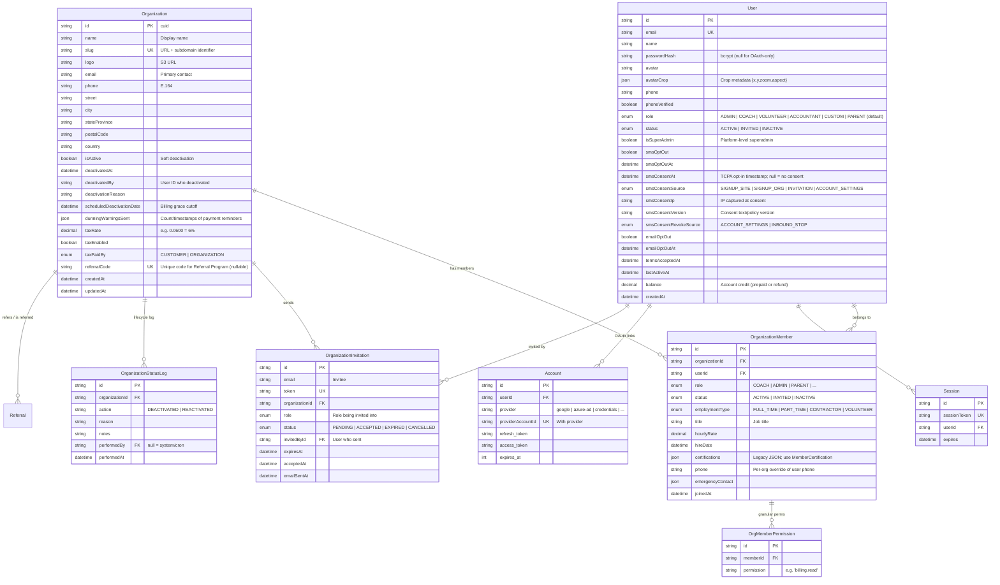

**Supporting auth tables (no FKs in / out):**

- `VerificationToken(identifier, token UK, expires)` — NextAuth email-link tokens.
- `PasswordResetToken(id, email, token UK, expiresAt, usedAt)` — forgot-password flow.
- `EmailVerificationCode(id, email, code, token UK, type [MFA_CHALLENGE | EMAIL_LOGIN | SIGNUP_VERIFICATION | PHONE_VERIFICATION], expiresAt, usedAt)` — OTP for MFA + passwordless login.
- `ReservedDomain(id, pattern UK, type [EXACT | PREFIX], reason, createdBy)` — org-slug denylist.

**SMS consent (TCPA / Twilio toll-free verification compliance):** Sends are gated on `User.smsConsentAt != null && smsOptOut == false`. Absence of `smsConsentAt` is treated as _no consent_. Inbound `STOP` clears consent and sets `smsConsentRevokeSource = INBOUND_STOP`.

- `SmsConsentSource` — where opt-in was captured: `SIGNUP_SITE` (/sites/[slug]/signup), `SIGNUP_ORG` (/org-signup, /get-started), `INVITATION` (/accept-invitation), `ACCOUNT_SETTINGS`.
- `SmsConsentRevokeSource` — how opt-out happened: `ACCOUNT_SETTINGS` (user toggle) or `INBOUND_STOP` (Twilio webhook).

---

## 2. Athletes & Guardians

`Athlete` is **intentionally shared across organizations** — the same child/athlete may train at multiple clubs. `OrganizationAthlete` controls which orgs can see that athlete; `AthleteGuardian` ties guardian users (parents) to athletes with privacy controls. `Athlete.userId` is set when the athlete is also their own user (adult self-athlete).

```mermaid
erDiagram
    Athlete ||--o{ AthleteGuardian : "has guardians"
    User ||--o{ AthleteGuardian : "guardian of"
    Athlete ||--o| User : "self-user (adult athlete)"
    Athlete ||--o{ OrganizationAthlete : "visible to orgs"
    Organization ||--o{ OrganizationAthlete : "rosters"
    Athlete ||--o{ GuardianClaimRequest : "claim requests"
    User ||--o{ GuardianClaimRequest : "requested by"
    User ||--o{ UserContact : "emergency contacts"
    User ||--o{ UserBillingAddress : "billing addresses"

    Athlete {
        string id PK
        string name "Legacy single-name field"
        string firstName
        string lastName
        string email "Athlete's own email (adults / teens)"
        string avatar
        json avatarCrop "Crop metadata {x,y,zoom,aspect}"
        datetime birthDate "For age gating"
        enum gender "MALE | FEMALE | OTHER | PREFER_NOT_TO_SAY"
        json medicalDetails "Legacy blob — prefer AthleteMedicalInfo"
        string userId FK_UK "Set only for self-athletes"
        boolean allowGuardianClaims "Can other guardians request to link?"
    }

    AthleteGuardian {
        string id PK
        string athleteId FK
        string userId FK "Guardian user"
        string relationship "Parent | Grandparent | Self | ..."
        boolean isPrimary "Primary contact / biller"
        boolean shareRegistrations "Other guardians see registrations"
        boolean shareFinancials "Other guardians see invoices/payments"
    }

    OrganizationAthlete {
        string id PK
        string organizationId FK
        string athleteId FK
        string level "e.g. Bronze, Unassigned"
        enum status "ACTIVE | INACTIVE | TRIAL | GRADUATED"
        string customId "Org-specific athlete ID (e.g. gym number)"
    }

    GuardianClaimRequest {
        string id PK
        string athleteId FK
        string requestingUserId FK
        enum status "PENDING | APPROVED | DENIED"
        string relationship "Requested relationship"
        string reviewedByUserId FK
        datetime reviewedAt
    }

    UserContact {
        string id PK
        string userId FK
        string firstName
        string lastName
        string email
        string phone
        string relationship "Self | Spouse | Other"
        boolean isPrimary
    }

    UserBillingAddress {
        string id PK
        string userId FK
        string label "Home | Work"
        string street
        string city
        string stateProvince
        string postalCode
        string country "ISO-2, default US"
        boolean isPrimary
    }
```

---

## 3. Medical & Custom Information

Medical info is attached to the athlete (cross-org shared for safety). Each org tailors which questions appear via `MedicalFormConfig` and `CustomMedicalQuestion`. The parallel "Custom Info" system collects arbitrary org-defined data scoped to products (programs/events/competitions/memberships/passes/seasons).

```mermaid
erDiagram
    Organization ||--o| MedicalFormConfig : "form toggles"
    Organization ||--o{ CustomMedicalQuestion : "adds questions"
    Athlete ||--o| AthleteMedicalInfo : "medical record"
    AthleteMedicalInfo ||--o{ CustomMedicalResponse : "answers"
    CustomMedicalQuestion ||--o{ CustomMedicalResponse : "answered in"

    Organization ||--o| CustomInfoConfig : "validity window"
    Organization ||--o{ CustomInfoQuestion : "defines"
    CustomInfoQuestion ||--o{ CustomInfoQuestionScope : "applies to"
    CustomInfoQuestion ||--o{ CustomInfoResponse : "answers"
    Athlete ||--o{ CustomInfoResponse : "answered about"
    User ||--o{ CustomInfoResponse : "answered by"

    MedicalFormConfig {
        string organizationId FK_UK
        boolean collectAllergies
        boolean collectMedications
        boolean collectConditions
        boolean collectEmergencyContact
        boolean collectDietaryRestrictions
        boolean collectInsuranceInfo
        int validityDays "Days before re-collection required"
    }

    CustomMedicalQuestion {
        string id PK
        string organizationId FK
        string questionText
        enum questionType "TEXT | YES_NO | MULTIPLE_CHOICE | CHECKBOX"
        json options "String[] for choice types"
        boolean required
        int displayOrder
        boolean isActive
    }

    AthleteMedicalInfo {
        string id PK
        string athleteId FK_UK
        string_array allergies
        string_array medications
        string_array conditions
        string_array dietaryRestrictions
        string insuranceProvider
        string insurancePolicyNumber
        string emergencyContactName
        string emergencyContactPhone
        string emergencyContactRelation
        string additionalNotes
        string lastUpdatedBy "User ID of last editor"
    }

    CustomMedicalResponse {
        string id PK
        string medicalInfoId FK
        string questionId FK
        string response "Parsed by question type"
    }

    CustomInfoConfig {
        string organizationId FK_UK
        int validityDays "Default response lifetime"
    }

    CustomInfoQuestion {
        string id PK
        string organizationId FK
        string questionText
        string description
        enum questionType "VALUE | BOOLEAN | SIGNATURE | SHORT_TEXT | LONG_TEXT | IMAGE"
        boolean required
        int displayOrder
        boolean isActive
        float valueMin "For VALUE type"
        float valueMax
        boolean allowDecimals
        boolean requireSignatureOnYes "Trigger signature when BOOLEAN=true"
        int validityDays "null = indefinite"
    }

    CustomInfoQuestionScope {
        string id PK
        string questionId FK
        enum scopeType "ALL_PROGRAMS | PROGRAM | EVENT | COMPETITION | MEMBERSHIP | PASS | SEASON | ..."
        string targetId "null for ALL_* scopes"
    }

    CustomInfoResponse {
        string id PK
        string athleteId FK
        string organizationId FK
        string questionId FK
        string responseValue "Text answer"
        string signatureData "Base64 PNG"
        string fileUrl "For IMAGE type"
        string storageKey "S3 key"
        string fileName
        string contentType
        datetime respondedAt
        string respondedById FK "User who entered response"
    }
```

---

## 4. Programs, Instances, Seasons, Enrollments

`Program` is a recurring offering (class, clinic). RFC 5545 `rrule` + `startDate`/`endDate` generate `ProgramInstance` records (one per session). Registration can be at program level (`Enrollment` — default) or per-instance (`InstanceRegistration`, used when `registrationType = PER_INSTANCE`).

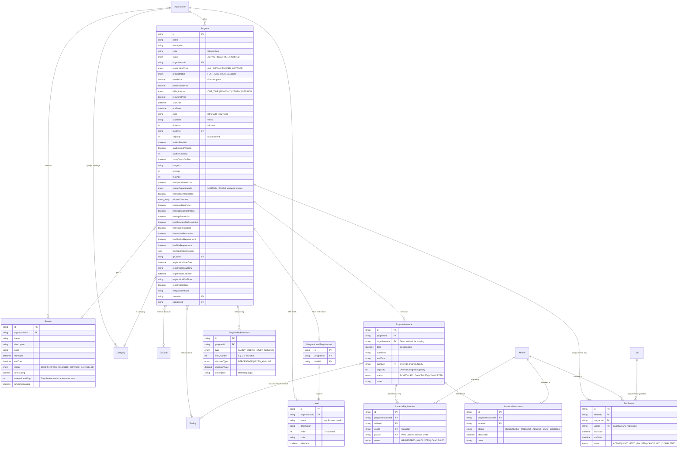

---

## 5. Events & Attendance

`Event` is a standalone calendar entity — one-off classes, tryouts, parties — optionally linked to a `Program`. `Attendance` tracks per-athlete presence for events (mirror of `InstanceAttendance` for program sessions).

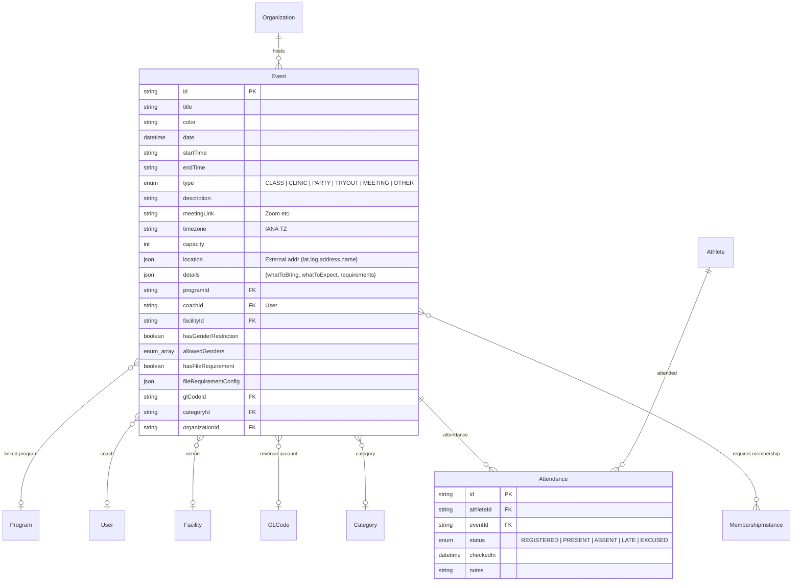

---

## 6. Memberships & Passes

Two distinct constructs:

- **Membership** — time-bound access (annual, seasonal). `MembershipGroup` = definition, `MembershipInstance` = a specific period (e.g. "FY25"), `AthleteMembership` = the individual's subscription.
- **Pass** — session-credit based (N sessions per week/month). Can cover or gate specific programs.

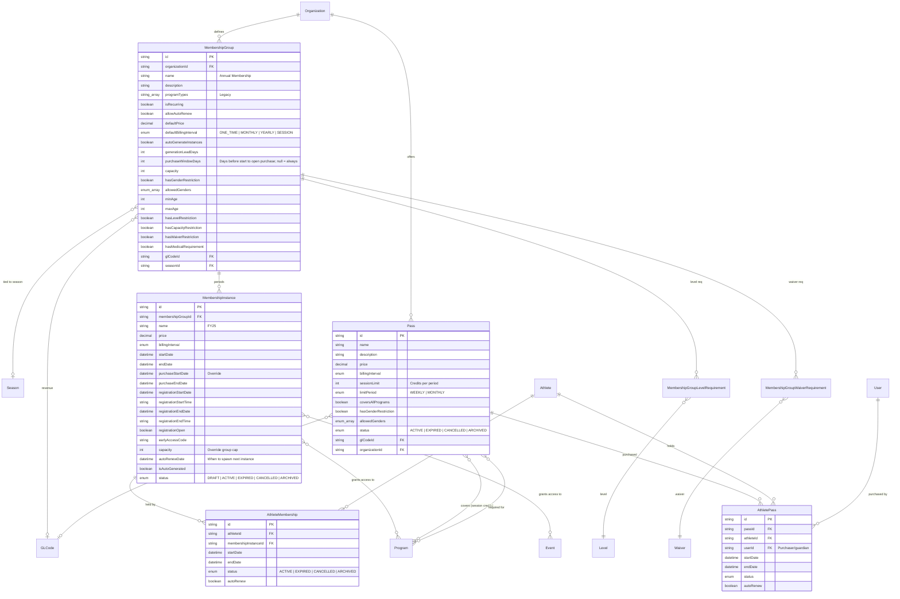

---

## 7. Evaluations, Skills, Achievements

Coaches assess athletes against a template of skills. `Skill` is the leaf unit; `EvaluationTemplate` groups skills (with scoring + completion rules); `Evaluation` is an athlete's assessment; `AthleteSkillProgress` is a rolled-up all-time per-skill record. `Achievement` is a badge earned from passing a template. `LessonPlan` + `Rotation` reuse skills for session planning.

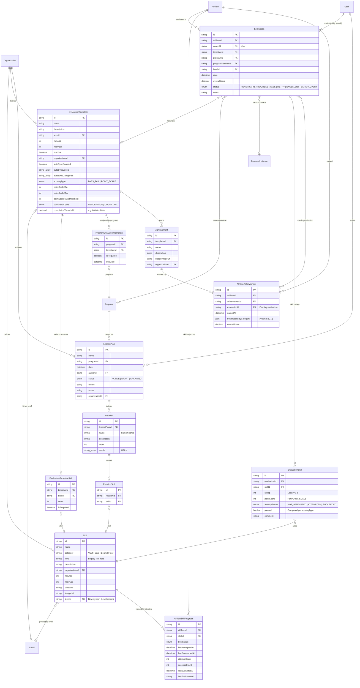

---

## 8. Competitions & Sports

The competition subsystem has two layers:

- **Sports registry** (global): `Sport`, `SportEvent`, `SportAgeCategory`, `SportEventEligibility` — platform-wide catalog (100m, U10, etc.).
- **Competition runtime**: `Competition` → `CompetitionCategory` → `CompetitionEntry` → `CompetitionResult`. Categories may reference legacy template-based entries (`CompetitionCategoryTemplate` + `CategoryAxisValue` + `CategoryCombinationEntry` / `CategoryIndividualEntry`) or new sport-event refs.

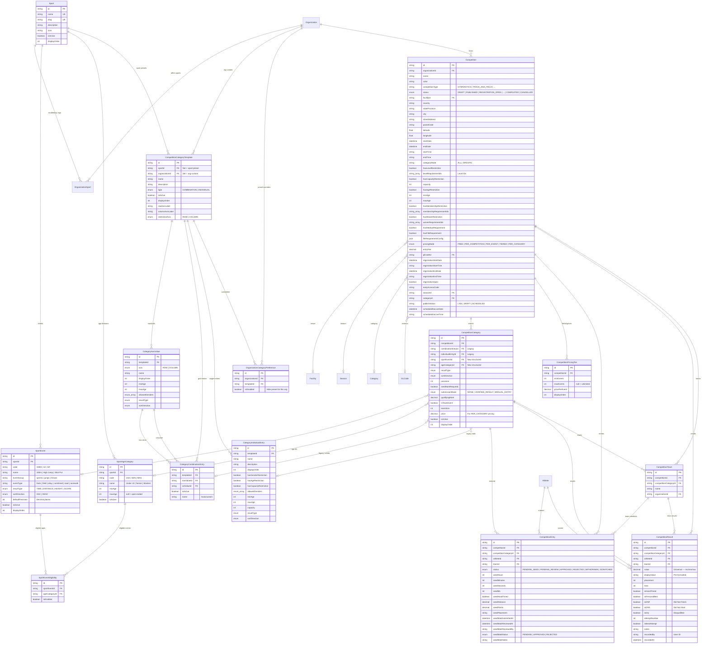

---

## 9. Financial (Invoices, Payments, Ledger)

`Invoice` is the billing root. Each `LineItem` is a billable row that references _what_ was bought (program/event/membership/pass/competition/product/athlete) and the `GLCode` it maps to. `Payment` records a settlement against an invoice; `Transaction` carries the Adyen PSP reference (one Adyen record = one Payment). `Payout` is the bank settlement batch. `RecurringCharge` drives auto-billing (memberships, passes, recurring enrollments). `LedgerEntry` is the journal entry for accounting. `PaymentMethod` is the stored Adyen token on the guardian (`User`).

```mermaid
erDiagram
    Organization ||--o{ Invoice : "issues"
    User ||--o{ Invoice : "billed to (guardian)"
    Invoice ||--o{ LineItem : "contains"
    Invoice ||--o{ Payment : "settled by"
    Invoice ||--o| Order : "POS/online order"

    LineItem }o--o| Program : "for program"
    LineItem }o--o| Event : "for event"
    LineItem }o--o| Athlete : "for athlete"
    LineItem }o--o| MembershipInstance : "for membership"
    LineItem }o--o| Pass : "for pass"
    LineItem }o--o| Competition : "for competition"
    LineItem }o--o| CompetitionCategory : "for comp category"
    LineItem }o--o| Product : "for product"
    LineItem }o--o| ProductVariant : "for variant"
    LineItem }o--o| Discount : "applied discount"
    LineItem }o--o| GLCode : "revenue bucket"

    Payment ||--o| Transaction : "Adyen PSP record"
    User ||--o{ Payment : "paid by (guardian)"
    Organization ||--o{ Transaction : "processes"
    Organization ||--o{ Payout : "receives"
    Payout ||--o{ Transaction : "batched"

    User ||--o{ PaymentMethod : "owns card"
    PaymentMethod ||--o{ RecurringCharge : "auto-billed via"
    Organization ||--o{ RecurringCharge : "originated"
    User ||--o{ RecurringCharge : "billed (guardian)"
    Athlete ||--o{ RecurringCharge : "for athlete"
    RecurringCharge }o--o| AthletePass : "pass renewal"
    RecurringCharge }o--o| AthleteMembership : "membership renewal"
    RecurringCharge }o--o| Enrollment : "tuition"

    Organization ||--o{ Discount : "code-based"
    Organization ||--o{ GLCode : "chart of accounts"
    Organization ||--o{ LedgerEntry : "journal"
    GLCode ||--o{ LedgerEntry : "entries"

    Invoice {
        string id PK
        string reference UK "Human-readable number"
        string userId FK "Guardian"
        enum status "DRAFT | SENT | PAID | OVERDUE | CANCELLED | PARTIAL"
        datetime dueDate
        decimal subtotal
        decimal tax
        decimal processingFee "Adyen surcharge if passed to customer"
        decimal total
        string notes
        string organizationId FK
        boolean postPaymentProcessed "Post-payment side effects (registrations, credits, etc.) applied"
    }

    LineItem {
        string id PK
        string invoiceId FK
        string description
        int quantity
        decimal unitPrice
        decimal total
        string programId FK
        string eventId FK
        string athleteId FK
        string discountId FK
        string membershipInstanceId FK
        string passId FK
        string competitionId FK
        string competitionCategoryId FK
        string productId FK
        string productVariantId FK
        string glCodeId FK
    }

    Payment {
        string id PK
        string invoiceId FK
        string userId FK
        decimal amount
        enum method "CARD | BANK | CASH | CHECK"
        enum status "PENDING | COMPLETED | FAILED | REFUNDED"
        string transactionId "Legacy string field"
        datetime processedAt
    }

    Transaction {
        string id PK
        string organizationId FK
        string paymentId FK_UK
        string pspReference UK "Adyen PSP ref"
        string merchantRef "Our internal ref"
        enum type "PAYMENT | REFUND | CHARGEBACK | CAPTURE | CANCEL"
        decimal amount
        string currency "USD default"
        enum status "AUTHORISED | CAPTURED | SETTLED | REFUSED | CANCELLED | ERROR | PENDING"
        string method "visa | mc | applepay | ..."
        string description
        json metadata "Raw Adyen payload"
        datetime settledAt
        string payoutId FK
        decimal feeRate "Plan rate at charge time"
        decimal feeFixed "Plan fixed fee at charge time"
    }

    Payout {
        string id PK
        string organizationId FK
        string reference UK "Adyen payout ref"
        decimal amount "Gross"
        decimal fees
        decimal net
        string currency
        enum status "PENDING | SCHEDULED | PAID | FAILED"
        string bankAccount "Last 4"
        datetime scheduledAt
        datetime paidAt
        datetime estimatedArrivalTime
    }

    PaymentMethod {
        string id PK
        string userId FK
        enum type "CARD | BANK"
        string last4
        string expiry "MM/YY"
        string brand "visa | mc | amex"
        boolean isDefault
        string adyenTokenId UK "Adyen stored method token"
        string shopperReference "Adyen shopper ID"
    }

    RecurringCharge {
        string id PK
        string organizationId FK
        string userId FK "Billed guardian"
        string athleteId FK
        string description
        decimal amount
        enum frequency "MONTHLY | YEARLY | SESSION"
        datetime nextChargeDate
        datetime lastChargedAt
        datetime lastAttemptAt "For retry spacing"
        enum status "ACTIVE | PAUSED | CANCELLED | FAILED"
        string paymentMethodId FK
        int failureCount
        string athletePassId FK
        string athleteMembershipId FK
        string enrollmentId FK
    }

    Discount {
        string id PK
        string name
        string code UK
        enum type "PERCENTAGE | FIXED_AMOUNT"
        decimal amount
        datetime validFrom
        datetime validTo
        enum userScope "ALL | NEW_USERS | MEMBERS | VIP"
        enum productScope "ALL | MERCHANDISE | EVENTS | MEMBERSHIP"
        int usageLimit "null = unlimited"
        int usageCount
        enum status "ACTIVE | EXPIRED | SCHEDULED | DRAFT"
        string organizationId FK
    }

    GLCode {
        string id PK
        string code "Chart-of-accounts code"
        string description
        enum type "REVENUE | EXPENSE | LIABILITY | ASSET | EQUITY"
        enum status "ACTIVE | INACTIVE"
        boolean isDefault
        enum defaultForType "PROGRAM | EVENT | COMPETITION | MEMBERSHIP | PASS | PRODUCT"
        string organizationId FK
    }

    LedgerEntry {
        string id PK
        datetime date
        string description
        string glCodeId FK
        string reference "e.g. invoice ref"
        decimal debit
        decimal credit
        enum status "POSTED | PENDING"
        string organizationId FK
    }
```

---

## 10. Waivers & Signatures

A `Waiver` has ordered `WaiverPage`s (HTML). Customers sign each page (`WaiverSignature`, base64 PNG). `WaiverAcceptance` is the rolled-up "this athlete+guardian completed all pages" record, used for "signed once, valid across programs" logic.

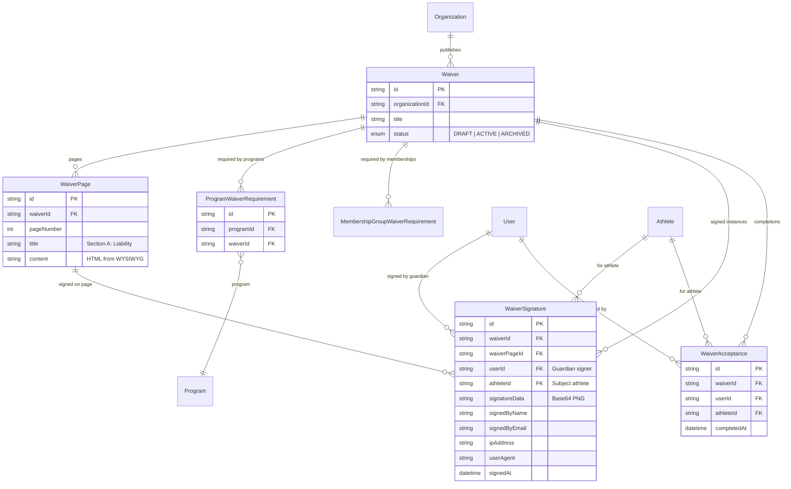

---

## 11. Facilities, Spaces, Equipment

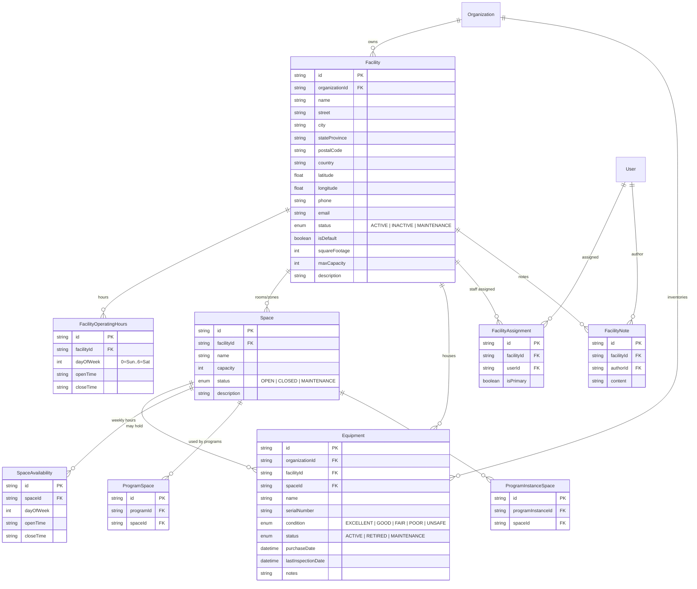

---

## 12. Staff & Scheduling

Staff-to-program/event assignments plus shift scheduling. `ShiftTemplate` patterns → concrete `Shift` records.

```mermaid
erDiagram
    OrganizationMember ||--o{ EventStaff : "works event"
    Event ||--o{ EventStaff : "staffed"
    OrganizationMember ||--o{ ProgramStaff : "coaches program"
    Program ||--o{ ProgramStaff : "coaching roster"
    OrganizationMember ||--o{ Shift : "scheduled"
    OrganizationMember ||--o{ MemberAvailability : "weekly availability"
    OrganizationMember ||--o{ MemberCertification : "certifications earned"
    OrganizationMember ||--o{ MemberCertification : "granted by (admin)"
    Organization ||--o{ Shift : "schedules"
    Organization ||--o{ ScheduleTemplate : "templates"
    ScheduleTemplate ||--o{ ScheduleTemplateEntry : "slots"
    Organization ||--o{ Certification : "defines"
    Certification ||--o{ MemberCertification : "held by members"
    OrganizationMember ||--o| TeamMemberHighlight : "marketing highlight"

    EventStaff {
        string id PK
        string eventId FK
        string memberId FK
        enum role "LEAD | ASSISTANT | VOLUNTEER | OBSERVER"
        string notes
    }

    ProgramStaff {
        string id PK
        string programId FK
        string memberId FK
        enum role "LEAD_COACH | ASSISTANT_COACH | SUBSTITUTE | VOLUNTEER"
        boolean isPrimary
        string notes
    }

    Shift {
        string id PK
        string organizationId FK
        string memberId FK
        string facilityId FK
        datetime date
        string startTime
        string endTime
        string shiftType "Opening Manager | Coach | Front Desk"
        enum status "SCHEDULED | CONFIRMED | IN_PROGRESS | COMPLETED | CANCELLED | NO_SHOW"
        string notes
    }

    ScheduleTemplate {
        string id PK
        string organizationId FK
        string name "Standard Week | Summer"
        boolean isActive
    }

    ScheduleTemplateEntry {
        string id PK
        string templateId FK
        int dayOfWeek
        string startTime
        string endTime
        string shiftType
        string memberId FK "null = unassigned"
        string facilityId FK
    }

    MemberAvailability {
        string id PK
        string memberId FK
        int dayOfWeek
        string startTime
        string endTime
        boolean isAvailable
    }

    Certification {
        string id PK
        string organizationId FK
        string name
        string description
        string criteria
        enum evaluationMethod "PASS_FAIL | POINT_SCALE"
        int pointScaleMin
        int pointScaleMax
        int passThreshold
        int renewalPeriodMonths "null = no renewal"
        boolean requiredForPrograms
        boolean requiredForEvents
        boolean requiredForCompetitions
        boolean isActive
    }

    MemberCertification {
        string id PK
        string certificationId FK
        string memberId FK
        string grantedById FK "Member who granted"
        boolean passed
        int score
        string notes
        datetime grantedAt
        datetime expiresAt
    }

    TeamMemberHighlight {
        string id PK
        string organizationId FK
        string memberId FK_UK
        int displayOrder
        string overrideImage
        string title
        string bio
        boolean isVisible
    }
```

---

## 13. Communications

Three-layer messaging model:

1. **Campaigns** — bulk sends to filtered audiences (`SmsCampaign`, `EmailCampaign`).
2. **Conversations** — 1:1 threads (SMS, web, or email).
3. **Transactional messages** — stored per-send in `Message` and `EmailMessage`.

Plus `Announcement` (in-app org bulletin board) and `SystemAnnouncement` (superadmin → all orgs).

```mermaid
erDiagram
    Organization ||--o{ Message : "sms/web msgs"
    Organization ||--o{ EmailMessage : "email msgs"
    Organization ||--o{ SmsCampaign : "sms campaigns"
    Organization ||--o{ EmailCampaign : "email campaigns"
    Organization ||--o{ Conversation : "chat threads"
    Organization ||--o{ SmsUsage : "monthly sms usage"
    Organization ||--o{ EmailUsage : "monthly email usage"
    Organization ||--o{ SmsNumberAssignment : "twilio pool map"
    Organization ||--o{ Announcement : "in-app announcements"
    Announcement ||--o{ AnnouncementRead : "read receipts"
    User ||--o{ AnnouncementRead : "read by"
    SystemAnnouncement ||--o{ SystemAnnouncementRead : "read receipts"
    User ||--o{ SystemAnnouncement : "created by (superadmin)"
    User ||--o{ SystemAnnouncementRead : "read by"

    SmsCampaign ||--o{ Message : "expanded to"
    EmailCampaign ||--o{ EmailMessage : "expanded to"
    Conversation ||--o{ Message : "thread messages"
    User ||--o{ Conversation : "guardian side"
    User ||--o{ Conversation : "coach (for coach threads)"
    User ||--o{ Message : "recipient/sender"
    User ||--o{ EmailMessage : "recipient"

    Message {
        string id PK
        string organizationId FK
        string userId FK "Recipient guardian (outbound) / sender (inbound)"
        string campaignId FK
        string conversationId FK
        enum channel "WEB | SMS | EMAIL"
        string to "E.164 or email"
        string from "Twilio # or sender email"
        string body
        int segments "SMS segment count"
        string twilioSid UK
        enum twilioStatus "QUEUED | SENDING | SENT | DELIVERED | UNDELIVERED | FAILED"
        string sesMessageId UK "For email-typed messages"
        string emailSubject
        string htmlBody
        enum direction "OUTBOUND | INBOUND"
        enum classification "GENERAL | REMINDER | ALERT | BILLING | EVENT | NEWS"
        decimal cost "Cents, Twilio cost"
        datetime sentAt
        datetime deliveredAt
        datetime failedAt
        string errorCode
        string errorMessage
    }

    SmsCampaign {
        string id PK
        string organizationId FK
        string name
        string body
        enum classification
        enum targetScope "Legacy: ALL | PROGRAM | EVENT | GUARDIAN"
        enum targetType "ALL_USERS | ALL_MEMBERS | ALL_PROGRAM_REGISTRANTS | PROGRAM_ANY_INSTANCE | PROGRAM_SPECIFIC_INSTANCE | MEMBERSHIP_HOLDERS | SPECIFIC_USERS | ALL_GUARDIANS"
        string targetProgramId
        string targetEventId
        string targetMembershipStatus "ACTIVE | EXPIRED | null"
        string targetProgramInstanceId
        string_array targetMembershipGroupIds
        string_array targetUserIds
        enum status "DRAFT | SCHEDULED | SENDING | COMPLETED | FAILED | CANCELLED"
        int totalRecipients
        int sentCount
        int deliveredCount
        int failedCount
        datetime scheduledAt
        datetime startedAt
        datetime completedAt
        string createdById
    }

    Conversation {
        string id PK
        string organizationId FK
        string userId FK "Guardian"
        string phoneNumber "E.164"
        string email
        enum channel "WEB_ONLY | WEB_SMS | WEB_EMAIL"
        enum status "OPEN | CLOSED | ARCHIVED"
        datetime lastMessageAt
        string lastMessageBody
        int unreadCount "Org-side unread"
        int athleteUnreadCount "Guardian-side unread"
        string coachId FK "Set = coach<->guardian thread"
    }

    SmsUsage {
        string id PK
        string organizationId FK
        datetime periodStart
        datetime periodEnd
        int messagesSent
        int messagesDelivered
        int messagesFailed
        int totalSegments
        decimal totalCost
        int includedMessages "Plan allowance"
        int overageMessages
        decimal overageCost
    }

    SmsNumberAssignment {
        string id PK
        string phone "Guardian phone (E.164)"
        string twilioNumber "Pool number"
        string organizationId FK
    }

    EmailMessage {
        string id PK
        string organizationId FK
        string userId FK
        string campaignId FK
        string to
        string from
        string subject
        string htmlBody
        string textBody
        string sesMessageId UK
        enum status "QUEUED | SENDING | SENT | DELIVERED | OPENED | CLICKED | BOUNCED | COMPLAINED | FAILED"
        enum classification "GENERAL | PROGRAM_UPDATE | EVENT_UPDATE | MEMBERSHIP | BILLING | NEWSLETTER"
        datetime openedAt
        int openCount
        datetime clickedAt
        int clickCount
        datetime sentAt
        datetime deliveredAt
        datetime bouncedAt
        datetime complainedAt
        datetime failedAt
        string bounceType "Permanent | Transient"
        string bounceSubType
        string errorCode
        string errorMessage
    }

    EmailCampaign {
        string id PK
        string organizationId FK
        string name
        string subject
        string htmlBody
        string rawBody "Editor source"
        string textBody
        enum classification
        enum targetType
        string targetProgramId
        string targetEventId
        string targetMembershipStatus
        string targetProgramInstanceId
        string_array targetMembershipGroupIds
        string_array targetUserIds
        enum status
        int totalRecipients
        int sentCount
        int deliveredCount
        int openedCount
        int clickedCount
        int bouncedCount
        int complainedCount
        int failedCount
        datetime scheduledAt
        datetime startedAt
        datetime completedAt
        string createdById
    }

    EmailUsage {
        string id PK
        string organizationId FK
        datetime periodStart
        datetime periodEnd
        int emailsSent
        int emailsDelivered
        int emailsOpened
        int emailsClicked
        int emailsBounced
        int emailsComplained
        int emailsFailed
        int includedEmails
        int overageEmails
        decimal overageCost
    }

    Announcement {
        string id PK
        string title
        string content "HTML"
        enum targetScope "ALL | PROGRAM | EVENT | GUARDIAN"
        string targetProgramId
        string targetEventId
        enum status "DRAFT | PUBLISHED | ARCHIVED"
        enum priority "LOW | NORMAL | HIGH | URGENT"
        datetime publishedAt
        datetime expiresAt
        string organizationId FK
    }

    AnnouncementRead {
        string id PK
        string announcementId FK
        string userId FK
        datetime readAt
    }

    SystemAnnouncement {
        string id PK
        string title
        string content
        enum priority
        enum status
        datetime publishedAt
        datetime expiresAt
        string createdById FK "Superadmin user"
    }

    SystemAnnouncementRead {
        string id PK
        string announcementId FK
        string userId FK
        datetime readAt
    }
```

---

## 14. Notifications

Rule-driven automation. `NotificationRule` = trigger + timing + action; `NotificationTemplate` = message body with placeholders; `NotificationRecipientConfig` = who; `NotificationLog` = audit trail; `NotificationDeduplication` = idempotency per entity/user/rule.

```mermaid
erDiagram
    Organization ||--o{ NotificationRule : "configures"
    Organization ||--o{ NotificationLog : "audit"
    NotificationRule ||--o| NotificationTemplate : "message"
    NotificationRule ||--o| NotificationRecipientConfig : "recipients"
    NotificationRule ||--o{ NotificationLog : "fired"
    NotificationRule ||--o{ NotificationDeduplication : "dedup keys"

    NotificationRule {
        string id PK
        string organizationId FK
        string name
        string description
        enum triggerType "MEMBERSHIP_EXPIRY | PAYMENT_DUE | PROGRAM_REMINDER | EVENT_REMINDER | ATTENDANCE_MISSED | SKILL_ACHIEVED | BIRTHDAY | WAITLIST_OPENING | RECURRING_CHARGE_UPCOMING | ... | CUSTOM"
        int timingValue "e.g. 3 (days before)"
        enum timingUnit "MINUTES | HOURS | DAYS | WEEKS | MONTHS"
        enum timingDirection "BEFORE | AFTER | AT"
        enum actionType "ANNOUNCEMENT | EMAIL | SMS"
        boolean isSystem "Mandatory, cannot be disabled"
        boolean isActive
    }

    NotificationTemplate {
        string id PK
        string notificationRuleId FK_UK
        string subject "Email subject w/ placeholders"
        string body "Primary body w/ placeholders"
        string smsBody "Shorter variant"
    }

    NotificationRecipientConfig {
        string id PK
        string notificationRuleId FK_UK
        enum recipientType "GUARDIANS | MEMBERSHIP_HOLDERS | INTERNAL_USERS | CUSTOM"
        json filters "{programIds?, membershipGroupIds?, athleteStatuses?, userRoles?, includeInactive?}"
        string_array ccEmails
    }

    NotificationLog {
        string id PK
        string organizationId FK
        string notificationRuleId FK
        enum triggerType
        enum actionType
        string recipientEmail
        string recipientPhone
        string recipientName
        string athleteId
        string userId
        string subject
        string body "Rendered final content"
        enum status "PENDING | SENT | DELIVERED | FAILED | SKIPPED"
        string emailMessageId "-> EmailMessage"
        string smsMessageId "-> Message"
        string announcementId "-> Announcement"
        string errorMessage
        datetime scheduledFor
        datetime sentAt
    }

    NotificationDeduplication {
        string id PK
        string ruleId FK
        string entityType "membership | invoice | event | athlete | ..."
        string entityId "The specific entity"
        string userId "Guardian this was sent to"
        datetime sentAt
    }
```

---

## 15. Products & POS

```mermaid
erDiagram
    Organization ||--o{ Product : "sells"
    Product }o--o| GLCode : "revenue account"
    Product ||--o{ ProductVariant : "variants"
    Product ||--o{ StockMovement : "inventory log"
    ProductVariant ||--o{ StockMovement : "variant movements"
    Organization ||--o{ Order : "orders"
    Invoice ||--|| Order : "1:1 with invoice"

    Product {
        string id PK
        string organizationId FK
        string name
        string description
        string sku
        string category "General default"
        decimal price
        string imageUrl
        int maxInventory "null = unlimited or variant-managed"
        int currentInventory
        string typeName "e.g. Color, Size — null = no variants"
        boolean isActive
        string glCodeId FK
    }

    ProductVariant {
        string id PK
        string productId FK
        string label
        decimal price "Override product price"
        string imageUrl
        int maxInventory
        int currentInventory
        int sortOrder
        boolean isActive
    }

    StockMovement {
        string id PK
        string productId FK
        string productVariantId FK
        enum type "SALE | RESTOCK | ADJUSTMENT | RETURN"
        int quantity "Signed: + add, - sale"
        int previousQty
        int newQty
        string referenceId "invoiceId | orderId"
        string notes
        string createdBy "User ID"
    }

    Order {
        string id PK
        string invoiceId FK_UK
        string organizationId FK
        enum source "POS | ONLINE"
        enum fulfillmentStatus "PENDING | FULFILLED | CANCELLED"
        string customerName
        string customerEmail
        string customerPhone
        datetime fulfilledAt
        string fulfilledBy "User ID"
        string notes
    }
```

---

## 16. Registration Queue

Virtual waiting room for registration opening rushes.

```mermaid
erDiagram
    Organization ||--o{ RegistrationQueueConfig : "queue configs"
    Program ||--o{ RegistrationQueueConfig : "program-specific (optional)"
    RegistrationQueueConfig ||--o{ QueueEntry : "waiting users"
    QueueEntry ||--o| QueueReservation : "admitted reservation"
    Program ||--o{ QueueReservation : "reservations"

    RegistrationQueueConfig {
        string id PK
        string organizationId FK
        string programId FK "null = org-wide default"
        boolean isEnabled
        int reservationMinutes "Hold window once admitted"
        int maxConcurrent "Parallel registrants"
        enum activationType "ALWAYS | THRESHOLD | SCHEDULED"
        int activationThreshold "For THRESHOLD"
        datetime scheduledStart "For SCHEDULED"
        datetime scheduledEnd
    }

    QueueEntry {
        string id PK
        string queueConfigId FK
        string sessionToken UK "Browser identifier"
        string email
        int position "Current queue position"
        enum status "WAITING | ADMITTED | COMPLETED | EXPIRED | ABANDONED"
        datetime enteredAt
        datetime admittedAt
        datetime exitedAt
    }

    QueueReservation {
        string id PK
        string queueEntryId FK_UK
        string programId FK
        datetime startedAt
        datetime expiresAt
        datetime completedAt
        enum status "ACTIVE | COMPLETED | EXPIRED"
    }
```

---

## 17. Platform Subscription

Uplifter's own SaaS billing (superadmin charging orgs for the platform). Distinct from customer-facing billing. `AdyenPlatformAccount` represents an org's Adyen merchant onboarding state (Adyen for Platforms); `accountStatus` is an admin kill-switch independent of `onboardingStatus`, and `payoutSchedule` controls how often Adyen sweeps settled funds to the org's bank.

```mermaid
erDiagram
    Organization ||--o| OrganizationSubscription : "active plan"
    SubscriptionPlan ||--o{ OrganizationSubscription : "plans"
    Organization ||--o| OrganizationFeatureOverride : "per-org toggles"
    Organization ||--o| AdyenPlatformAccount : "merchant onboarding"
    Organization ||--o{ OrganizationPaymentMethod : "subscription cards"
    Organization ||--o{ SubscriptionInvoice : "platform invoices"
    SubscriptionPlan ||--o{ SubscriptionInvoice : "billed for plan"
    SubscriptionInvoice ||--o{ SubscriptionPaymentAttempt : "charge attempts"
    OrganizationPaymentMethod ||--o{ SubscriptionPaymentAttempt : "method used"

    SubscriptionPlan {
        string id PK
        string name "Free | Starter | Gold | Platinum"
        string slug UK
        string description
        decimal monthlyPrice
        decimal yearlyPrice "Optional annual rate"
        decimal transactionFee "e.g. 0.029"
        decimal perTransactionFee "e.g. 0.30"
        int maxAthletes "null = unlimited"
        int maxUsers
        int maxPrograms
        int maxEvents
        int smsIncluded "Per month"
        decimal smsOverageRate
        int emailIncluded
        decimal emailOverageRate
        int maxStorageMB
        int maxMembershipTypes
        json features "Display bullets"
        json featureToggles "Module booleans"
        boolean isPopular
        int displayOrder
        boolean isActive
        boolean isPublic "Self-selectable"
    }

    OrganizationSubscription {
        string id PK
        string organizationId FK_UK
        string planId FK
        enum status "ACTIVE | TRIALING | PAST_DUE | CANCELLED | PAUSED"
        enum billingCycle "MONTHLY | YEARLY"
        datetime currentPeriodStart
        datetime currentPeriodEnd
        string stripeCustomerId "Legacy"
        string stripeSubscriptionId "Legacy"
        string adyenShopperReference UK
        string adyenRecurringDetailRef "Primary token"
        boolean isLocked "Org cannot change plan"
        string lockedReason
        string lockedBy "Superadmin"
        datetime lockedAt
        datetime trialEndsAt
        datetime nextBillingDate "When next platform invoice is generated; advanced +1 period after each cycle"
        boolean cancelAtPeriodEnd
        datetime cancelledAt
    }

    OrganizationFeatureOverride {
        string id PK
        string organizationId FK_UK
        json featureToggles "Overrides plan defaults"
        string updatedBy "Superadmin"
    }

    OrganizationPaymentMethod {
        string id PK
        string organizationId FK
        string storedPaymentMethodId UK "Adyen token"
        string shopperReference
        string type "scheme | sepadirectdebit"
        string brand
        string lastFour
        string expiryMonth
        string expiryYear
        string holderName
        boolean isDefault
        boolean isActive
        int priority "Charge order"
    }

    AdyenPlatformAccount {
        string id PK
        string organizationId FK_UK
        string legalEntityId UK
        string businessLineId
        string accountHolderId UK
        string balanceAccountId UK
        string storeId
        string storeReference
        enum onboardingStatus "PENDING_HOSTED | IN_PROGRESS | AWAITING_DATA | IN_REVIEW | VERIFIED | REJECTED"
        enum accountStatus "ACTIVE | INACTIVE (admin-controlled kill switch)"
        string verificationStatus
        json capabilities "Enabled Adyen capabilities"
        datetime legalNameConfirmedAt "Pre-onboarding gate"
        datetime platformFeeAcknowledgedAt
        datetime platformAgreementAcceptedAt
        string sweepId "Adyen sweep config"
        string transferInstrumentId
        string payoutSchedule "daily | weekly | monthly (default daily)"
    }

    SubscriptionInvoice {
        string id PK
        string organizationId FK
        string planId FK
        string reference UK
        datetime periodStart
        datetime periodEnd
        decimal amount
        string currency
        enum status "PENDING | PROCESSING | PAID | FAILED | VOID"
        datetime paidAt
        datetime failedAt
        string notes "Internal support notes"
        string voidedBy "Superadmin"
        datetime voidedAt
        decimal adjustedFrom "Original amount pre-adjustment"
        string markedPaidBy
        string markedPaidNote
    }

    SubscriptionPaymentAttempt {
        string id PK
        string subscriptionInvoiceId FK
        string paymentMethodId FK
        decimal amount
        string currency
        string status
        string pspReference
        string failureReason
        int attemptNumber
        datetime attemptedAt
    }
```

---

## 18. Accounting Integrations

QuickBooks Online / Xero. Encrypted OAuth tokens per org; mapping + queue + log pattern.

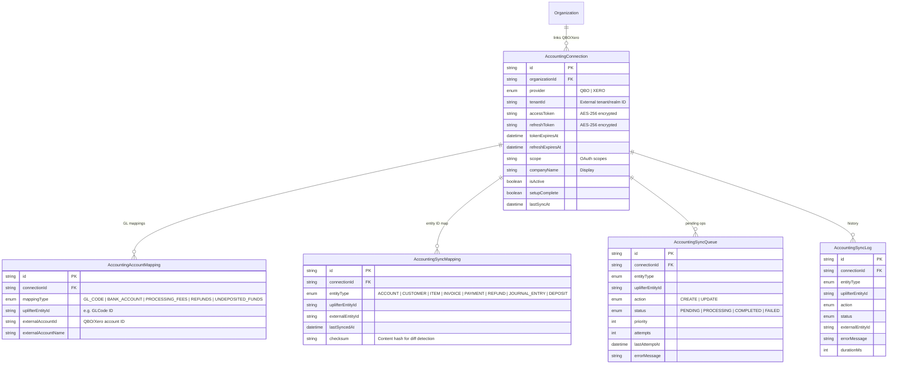

---

## 19. Feedback & Feature Requests

Public-facing roadmap on `feedback.` subdomain.

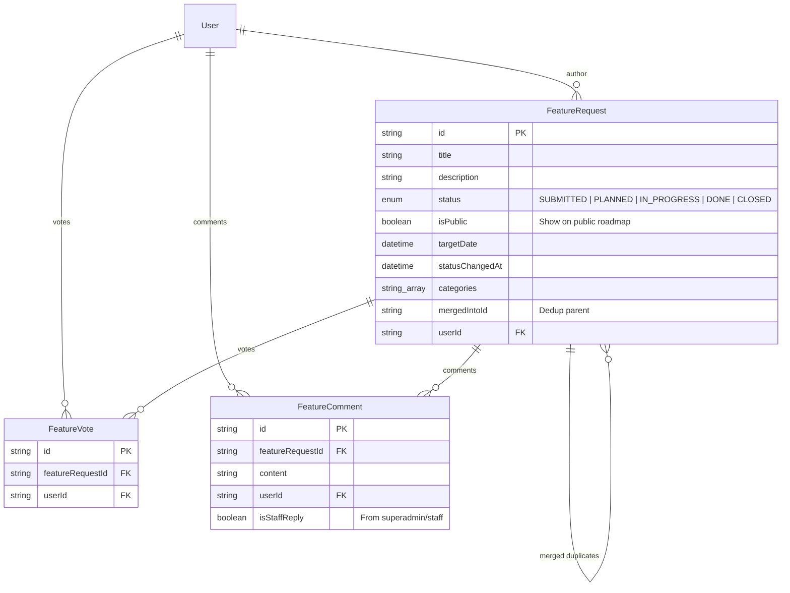

---

## 20. Misc / Cross-cutting

### Media & Registration Files

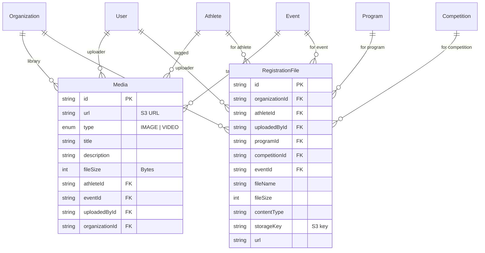

### Website Builder

`WebsiteConfig` drives each org's public marketing site (`[slug].uplifter.app`).

```mermaid
erDiagram
    Organization ||--o| WebsiteConfig : "site settings"

    WebsiteConfig {
        string id PK
        string organizationId FK_UK
        string primaryColor
        string secondaryColor
        string logo
        string favicon
        string heroImage
        string heroHeadline
        string heroSubheadline
        string heroText
        string heroAgeRange "All Ages Welcome | Ages 5-18"
        string heroProgramPeriods "Year-Round | Fall & Spring"
        string heroLocation "Austin, TX"
        boolean showCalendar
        boolean showRegistration
        boolean showContact
        boolean showCompetitions
        boolean showStore
        boolean showLocations
        boolean showTeam
        boolean showTeamCertifications
        string competitionsHeading
        string competitionsDescription
        string competitionsCtaText
        string domain UK "Custom domain"
        string subdomain UK "Uplifter subdomain"
        string emailSenderDomain "For SES FROM"
        boolean isPublished
        string seoDescription
        string seoKeywords
        string googleVerification
        string infoBox1Title
        string infoBox1Content
        string infoBox2Title
        string infoBox2Content
        string infoBox3Title
        string infoBox3Content
        string allProgramsCategoryImageUrl
    }
```

### Categories & Holidays

```mermaid
erDiagram
    Organization ||--o{ Category : "groups"
    Category ||--o{ Program : "contains"
    Category ||--o{ Event : "contains"
    Category ||--o{ Competition : "contains"
    Organization ||--o{ OrganizationHoliday : "holidays"
    OrganizationHoliday }o--o| Announcement : "closure announcement"

    Category {
        string id PK
        string name
        string description
        string imageUrl
        int displayOrder
        string organizationId FK
    }

    OrganizationHoliday {
        string id PK
        string organizationId FK
        datetime date
        string name
        enum type "NATIONAL | CUSTOM"
        boolean isEnabled
        int year
        string countryCode
        string stateCode
        string announcementId FK "Auto-created closure"
        datetime reminderEmailSentAt
    }
```

### Referral Program

Orgs earn free platform-subscription months by referring other orgs. `Organization.referralCode` is the shareable unique code; `Referral` is the credit ledger — each row is one referral relationship with a running balance of how many credit months have been applied against the referrer's `SubscriptionInvoice`s.

```mermaid
erDiagram
    Organization ||--o{ Referral : "ReferralsMade (referrer)"
    Organization ||--o{ Referral : "ReferralsReceived (referred)"

    Referral {
        string id PK
        string referrerOrganizationId FK "Org that shared the code"
        string referredOrganizationId FK "Org that signed up via code"
        int creditMonths "Total months awarded (default 1)"
        int creditMonthsUsed "Months already applied to invoices"
        datetime createdAt
    }
```

### Cache Versioning

Used by the API layer for cache invalidation — not a domain entity.

- `CacheVersion(organizationId, entityType, version, updatedAt)` with composite PK `(organizationId, entityType)`.

---

## Relationship Cheat Sheet — High-Cardinality Joins

Quick lookup for the most load-bearing joins in the system:

| Left entity           | Cardinality | Right entity                                           | Junction / FK                               | Notes                            |
| --------------------- | ----------- | ------------------------------------------------------ | ------------------------------------------- | -------------------------------- |
| `Organization`        | 1 — \*      | almost everything                                      | `organizationId`                            | Root tenant                      |
| `User`                | _ — _       | `Organization`                                         | `OrganizationMember`                        | User can be in multiple orgs     |
| `Athlete`             | _ — _       | `User` (guardians)                                     | `AthleteGuardian`                           | Many guardians per athlete       |
| `Athlete`             | _ — _       | `Organization`                                         | `OrganizationAthlete`                       | Athlete visible to multiple orgs |
| `Program`             | 1 — \*      | `ProgramInstance`                                      | FK                                          | rrule expansion                  |
| `Program`             | _ — _       | `Pass` (covers)                                        | `PassCoveredPrograms` (implicit M:N)        |                                  |
| `Program`             | _ — _       | `Waiver`                                               | `ProgramWaiverRequirement`                  |                                  |
| `Program`             | _ — _       | `MembershipInstance`                                   | implicit M:N                                | Membership gates program         |
| `MembershipGroup`     | 1 — \*      | `MembershipInstance`                                   | FK                                          | Period versions                  |
| `MembershipInstance`  | 1 — \*      | `AthleteMembership`                                    | FK                                          | Individual subscriptions         |
| `Invoice`             | 1 — \*      | `LineItem`                                             | FK                                          |                                  |
| `LineItem`            | \* — 1      | 9 possible targets                                     | `programId` / `eventId` / `athleteId` / ... | Polymorphic via nullable FKs     |
| `Payment`             | 1 — 0..1    | `Transaction`                                          | `paymentId` UK                              | Adyen record                     |
| `Payout`              | 1 — \*      | `Transaction`                                          | `payoutId` FK                               | Settlement batch                 |
| `RecurringCharge`     | \* — 0..1   | `AthleteMembership` / `AthletePass` / `Enrollment`     | nullable FKs                                | Auto-bill origin                 |
| `Competition`         | 1 — \*      | `CompetitionCategory`                                  | FK                                          |                                  |
| `CompetitionCategory` | 1 — \*      | `CompetitionEntry` / `CompetitionResult`               | FK                                          |                                  |
| `Athlete`             | 1 — \*      | `CompetitionEntry`                                     | FK                                          |                                  |
| `Facility`            | 1 — \*      | `Space`                                                | FK                                          |                                  |
| `Space`               | _ — _       | `Program`                                              | `ProgramSpace`                              |                                  |
| `NotificationRule`    | 1 — 0..1    | `NotificationTemplate` / `NotificationRecipientConfig` | FK UK                                       |                                  |
| `SmsCampaign`         | 1 — \*      | `Message`                                              | `campaignId`                                | Campaign fanout                  |
| `EmailCampaign`       | 1 — \*      | `EmailMessage`                                         | `campaignId`                                | Campaign fanout                  |
| `Conversation`        | 1 — \*      | `Message`                                              | `conversationId`                            | Thread                           |
