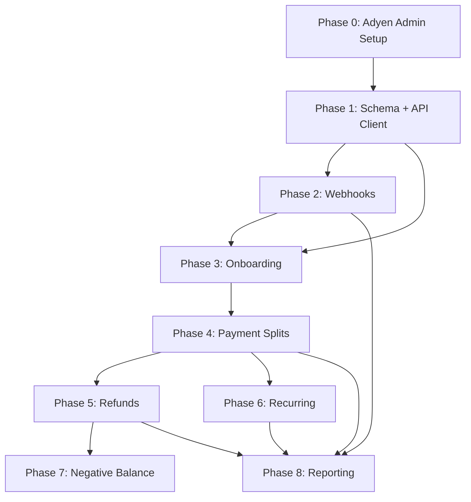

# Adyen Platform Integration -- Phase Specs

This directory contains detailed implementation specs for the Adyen for Platforms (marketplace model) integration. Each spec is designed to be self-contained and executable by an agent or developer independently.

## Architecture Overview

Leapfrog currently uses a single-merchant Adyen integration. This project migrates to the Adyen Balance Platform model where each club (Organization) gets its own Adyen account structure, enabling automatic payment splitting between the platform (Kirra) and each club.

```
Kirra Balance Platform
├── Liable Account (platform fees collected here)
└── Per-Club:
    ├── Legal Entity
    ├── Account Holder
    ├── Balance Account → Sweep → Club Bank Account
    └── Store (with split configuration profile)
```

## Dependency Graph



## Phase Index

| Phase | Spec | Type | Effort | Risk |
|---|---|---|---|---|
| 0 | [Prerequisites](phase-0-prerequisites.md) | Admin/config (no code) | 1-2 days | None |
| 1 | [Schema + API Client](phase-1-schema-and-api-client.md) | Backend foundation | 1-2 days | None |
| 2 | [Webhooks](phase-2-webhooks.md) | Backend (new + extend) | 1-2 days | Low |
| 3 | [Onboarding](phase-3-onboarding.md) | Backend + frontend | 3-5 days | None |
| 4 | [Payment Splits](phase-4-payment-splits.md) | Backend modification | 2-3 days | Medium |
| 5 | [Refunds](phase-5-refunds.md) | Backend (new) | 1-2 days | Low |
| 6 | [Recurring Charges](phase-6-recurring-charges.md) | Backend (new + modify) | 2-3 days | Medium |
| 7 | [Negative Balance](phase-7-negative-balance.md) | Backend (new) | 1-2 days | None |
| 8 | [Reporting](phase-8-reporting.md) | Backend + frontend | 3-5 days | Low |

**Total estimated effort**: 15-25 days

## Key Files

| File | Role | Modified In |
|---|---|---|
| `prisma/schema.prisma` | Database schema | Phase 1, 6, 7 |
| `src/lib/adyen.ts` | Existing Adyen checkout integration | Phase 4, 6 |
| `src/lib/adyen-platform.ts` | New platform API client | Phase 1, 5, 7 |
| `src/lib/webhooks.ts` | Webhook URL management | Phase 2 |
| `src/lib/services-config.ts` | Service configuration | Phase 2 |
| `src/app/api/webhooks/adyen/route.ts` | Payment webhook | Phase 2 |
| `src/app/api/webhooks/adyen-balance-platform/route.ts` | New balance platform webhook | Phase 2, 7 |
| `src/app/api/organization/adyen-onboarding/route.ts` | New onboarding API | Phase 3 |
| `src/app/api/sites/[slug]/checkout/session/route.ts` | Checkout session | Phase 4 |
| `src/app/api/recurring/route.ts` | Recurring charge batch | Phase 6 |
| `src/app/dashboard/financials/onboarding/page.tsx` | Onboarding dashboard | Phase 3 |
| `src/app/dashboard/financials/page.tsx` | Financial dashboard | Phase 8 |

## Environment Variables

New variables (added in Phase 0):
- `ADYEN_BALANCE_PLATFORM` = `UplifterLLC` -- balance platform ID
- `ADYEN_PLATFORM_MERCHANT_ACCOUNT` = `KirraCapital_Leapfrog_TEST` -- platform merchant account
- `ADYEN_ONBOARDING_THEME_ID` (optional) -- hosted onboarding theme; omit to use Adyen default
- `ADYEN_BP_CONFIG_WEBHOOK_HMAC_KEY` -- Configuration webhook HMAC
- `ADYEN_BP_TRANSFER_WEBHOOK_HMAC_KEY` -- Transfer webhook HMAC
- `ADYEN_BP_NEGBAL_WEBHOOK_HMAC_KEY` -- Negative Balance webhook HMAC
- `ADYEN_PLATFORM_API_KEY` -- BalancePlatform-scoped key for Configuration, Transfers APIs
- `ADYEN_LEM_API_KEY` -- Company-scoped key for Legal Entity Management API

Existing variables (unchanged):
- `ADYEN_API_KEY` -- Company-scoped checkout/payments key (`ws_396907@Company.KirraCapital`)
- `ADYEN_MERCHANT_ACCOUNT` = `KirraCapital_Leapfrog_TEST`
- `ADYEN_ENVIRONMENT` = `TEST`
- `NEXT_PUBLIC_ADYEN_CLIENT_KEY` = `test_EB5HMWNJJNGENK2OMNZK6LMU6IPHBN4O`
- `ADYEN_WEBHOOK_HMAC_KEY` (existing payment webhook HMAC)

## Adyen Account Structure

- **Company account**: `KirraCapital` (legal entity: Kirra Capital, US)
- **Merchant account**: `KirraCapital_Leapfrog_TEST`
- **Balance platform**: `UplifterLLC`

**API credentials** (triple-key setup):

| Credential | Env Var | Username | Scope | Used For |
|---|---|---|---|---|
| Checkout | `ADYEN_API_KEY` | `ws_396907@Company.KirraCapital` | Company | Checkout, Payment Links, Recurring, webhooks |
| Platform | `ADYEN_PLATFORM_API_KEY` | `ws_508000@BalancePlatform.UplifterLLC` | BalancePlatform | Configuration API, Transfers API |
| LEM | `ADYEN_LEM_API_KEY` | `ws_236609@Scope.Company_KirraCapital` | Company | Legal Entity Management API |

## Coexistence Strategy

The platform model is opt-in per organization. The system maintains backward compatibility:

- **Onboarded orgs** (have `AdyenPlatformAccount` with `VERIFIED` status): Use store reference and platform merchant account for payments. Auto-splits apply.
- **Non-onboarded orgs**: Continue using the existing single-merchant flow. No splits, no balance account. Zero behavior change.

This is implemented via a simple check: if `AdyenPlatformAccount` exists and is verified, use platform path; otherwise, use legacy path.

## Source Plan

The overarching plan document with critical assessment of the original consultant proposal is at: `adyen_plan.md` (project root).
