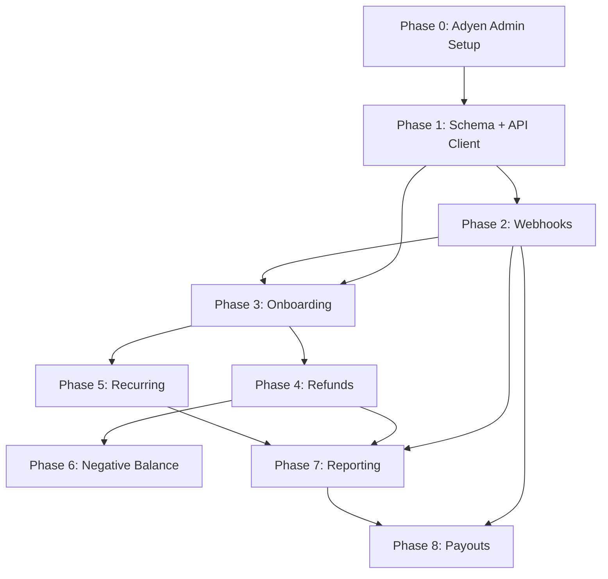

# Adyen Platform Integration -- Phase Specs

This directory contains detailed implementation specs for the Adyen for Platforms (marketplace model) integration. Each spec is designed to be self-contained and executable by an agent or developer independently.

## Architecture Overview

Leapfrog currently uses a single-merchant Adyen integration. This project migrates to the Adyen Balance Platform model where each club (Organization) gets its own Adyen account structure for onboarding, verification, and payouts.

```
Kirra Balance Platform
├── Liable Account (platform fees collected here)
└── Per-Club:
    ├── Legal Entity
    ├── Account Holder
    ├── Balance Account → Sweep → Club Bank Account
    └── Store
```

## Dependency Graph



## Phase Index

| Phase | Spec | Type | Effort | Risk |
|---|---|---|---|---|
| 0 | [Prerequisites](phase-0-prerequisites.md) | Admin/config (no code) | 1-2 days | None |
| 1 | [Schema + API Client](phase-1-schema-and-api-client.md) | Backend foundation | 1-2 days | None |
| 2 | [Webhooks](phase-2-webhooks.md) | Backend (new + extend) | 1-2 days | Low |
| 3 | [Onboarding](phase-3-onboarding.md) | Backend + frontend | 3-5 days | None |
| 4 | [Refunds](phase-4-refunds.md) | Backend (new) | 1-2 days | Low |
| 5 | [Recurring Charges](phase-5-recurring-charges.md) | Backend (new + modify) | 2-3 days | Medium |
| 6 | [Negative Balance](phase-6-negative-balance.md) | Backend (new) | 1-2 days | None |
| 7 | [Reporting](phase-7-reporting.md) | Backend + frontend | 3-5 days | Low |
| 8 | [Payouts](phase-8-payouts.md) | Backend + frontend + DevOps | 3-5 days | Low |

**Total estimated effort**: 16-27 days

## Key Files

| File | Role | Modified In |
|---|---|---|
| `prisma/schema.prisma` | Database schema | Phase 1, 5, 6 |
| `src/lib/adyen.ts` | Existing Adyen checkout integration | Phase 5 |
| `src/lib/adyen-platform.ts` | New platform API client | Phase 1, 4, 6 |
| `src/lib/webhooks.ts` | Webhook URL management | Phase 2 |
| `src/lib/services-config.ts` | Service configuration | Phase 2 |
| `src/app/api/webhooks/adyen/route.ts` | Payment webhook | Phase 2 |
| `src/app/api/webhooks/adyen-balance-platform/route.ts` | New balance platform webhook | Phase 2, 6 |
| `src/app/api/organization/adyen-onboarding/route.ts` | New onboarding API | Phase 3 |
| `src/app/api/recurring/route.ts` | Recurring charge batch | Phase 5 |
| `src/app/dashboard/financials/onboarding/page.tsx` | Onboarding dashboard | Phase 3 |
| `src/app/dashboard/financials/page.tsx` | Financial dashboard | Phase 7 |
| `src/app/api/payouts/route.ts` | Payouts list/create API | Phase 8 |
| `src/app/api/payouts/[id]/route.ts` | Payout detail API | Phase 8 |
| `src/app/dashboard/financials/payouts/page.tsx` | Payouts list page | Phase 8 |
| `src/app/dashboard/financials/payouts/[id]/page.tsx` | Payout detail page | Phase 8 |
| `scripts/provision-adyen.ts` | Multi-env Adyen provisioning | Phase 8 |

## Environment Variables

New variables (added in Phase 0):
- `ADYEN_BALANCE_PLATFORM` = `UplifterLLC` -- balance platform ID
- `ADYEN_PLATFORM_MERCHANT_ACCOUNT` = `KirraCapital_Leapfrog_TEST` -- platform merchant account
- `ADYEN_ONBOARDING_THEME_ID` (optional) -- hosted onboarding theme; omit to use Adyen default
- `ADYEN_BP_CONFIG_WEBHOOK_HMAC_KEY` -- Configuration webhook HMAC
- `ADYEN_BP_TRANSFER_WEBHOOK_HMAC_KEY` -- Transfer webhook HMAC
- `ADYEN_BP_NEGBAL_WEBHOOK_HMAC_KEY` -- Negative Balance webhook HMAC
- `ADYEN_PLATFORM_API_KEY` -- BalancePlatform-scoped key for Configuration, Transfers APIs
- `ADYEN_LEM_API_KEY` -- Company-scoped key for Legal Entity Management API

Existing variables (unchanged):
- `ADYEN_API_KEY` -- Company-scoped checkout/payments key (`ws_396907@Company.KirraCapital`)
- `ADYEN_MERCHANT_ACCOUNT` = `KirraCapital_Leapfrog_TEST`
- `ADYEN_ENVIRONMENT` = `TEST`
- `NEXT_PUBLIC_ADYEN_CLIENT_KEY` = `test_EB5HMWNJJNGENK2OMNZK6LMU6IPHBN4O`
- `ADYEN_WEBHOOK_HMAC_KEY` (existing payment webhook HMAC)

## Adyen Account Structure

- **Company account**: `KirraCapital` (legal entity: Kirra Capital, US)
- **Merchant account**: `KirraCapital_Leapfrog_TEST`
- **Balance platform**: `UplifterLLC`

**API credentials** (triple-key setup):

| Credential | Env Var | Username | Scope | Used For |
|---|---|---|---|---|
| Checkout | `ADYEN_API_KEY` | `ws_396907@Company.KirraCapital` | Company | Checkout, Payment Links, Recurring, webhooks |
| Platform | `ADYEN_PLATFORM_API_KEY` | `ws_508000@BalancePlatform.UplifterLLC` | BalancePlatform | Configuration API, Transfers API |
| LEM | `ADYEN_LEM_API_KEY` | `ws_236609@Scope.Company_KirraCapital` | Company | Legal Entity Management API |

## Local Development Setup

### Webhooks via ngrok

Adyen delivers webhook notifications to public URLs. For local development, use [ngrok](https://ngrok.com/) to tunnel requests to your local Next.js server:

1. **Install ngrok** and authenticate with your ngrok account
2. **Start a tunnel** to your local dev server:
   ```bash
   ngrok http 3000
   ```
3. **Set the tunnel URL** in your `.env`:
   ```
   WEBHOOK_TUNNEL_URL=https://abcd-1234.ngrok-free.app
   ```
   The webhook URL helper in `src/lib/webhooks.ts` automatically uses `WEBHOOK_TUNNEL_URL` when `APP_ENVIRONMENT=local`.
4. **Create webhook subscriptions** in the [Adyen Customer Area](https://ca-test.adyen.com) pointing to your ngrok URL:
   - Standard payment webhook → `{ngrok_url}/api/webhooks/adyen`
   - Balance Platform webhooks (3x) → `{ngrok_url}/api/webhooks/adyen-balance-platform`
5. **Generate HMAC keys** for each subscription and add them to your `.env`.

### Dollar-sign escaping in `.env`

Next.js uses `dotenv-expand` which interpolates `$VAR` syntax. If your Adyen API keys contain `$` characters, you must escape them with a backslash:

```
ADYEN_API_KEY=AQEyhmfxKo3...before\$after...rest_of_key
```

Without the `\`, everything after `$` is treated as a variable reference and the key gets truncated.

### Test data for hosted onboarding

When testing the Adyen hosted onboarding flow in the `TEST` environment, use these placeholder values:

| Field | Test Value |
|---|---|
| EIN (Tax ID) | `123456789` |
| SSN (last 4) | `1234` |
| Bank routing number | `121000248` |
| Bank account number | `123456789` |
| Document uploads | Any valid image/PDF (Adyen auto-approves in TEST) |

## Staging / Production Provisioning

### Automated provisioning (recommended)

The `scripts/provision-adyen.ts` script automates API credential creation, webhook setup, and HMAC key generation for any environment:

```bash
# Preview what will be created
npx tsx scripts/provision-adyen.ts --env staging --dry-run

# Create credentials and webhooks, output .env fragment
npx tsx scripts/provision-adyen.ts --env staging --output .env.adyen

# Create and deploy directly to remote host via SSH
npx tsx scripts/provision-adyen.ts --env staging --deploy-ssh uplifter-staging

# Production
npx tsx scripts/provision-adyen.ts --env production --output .env.adyen
```

The script:
1. Discovers the Company ID from the Management API using your local `ADYEN_API_KEY`
2. Creates or finds 3 API credentials (checkout, platform, LEM) and generates API keys
3. Creates 4 webhook subscriptions (1 standard payment + 3 balance platform) pointing to the environment's admin URL
4. Generates HMAC keys for each webhook
5. Outputs all keys as a `.env` fragment (optionally writes to file or deploys via SSH)

After running, redeploy to pick up the new environment variables:
```bash
./scripts/deploy-staging.sh
```

> **Legacy**: The older `scripts/provision-adyen-staging.ts` is kept for backward compatibility but `provision-adyen.ts` is the preferred replacement.

### Manual alternative

If the script is not available or you need to create webhooks manually:
1. Go to [Adyen Customer Area](https://ca-test.adyen.com) → Developers → Webhooks
2. Create a standard webhook pointing to `https://admin.upliftergymnastics.com/api/webhooks/adyen`
3. Go to Balance Platforms → UplifterLLC → Webhooks
4. Create three subscriptions (Configuration, Transfer, Negative Balance) pointing to `https://admin.upliftergymnastics.com/api/webhooks/adyen-balance-platform`
5. Generate HMAC keys for each and manually update `~/.env.uplifter` on the EC2 instance

## Coexistence Strategy

The platform model is opt-in per organization. The system maintains backward compatibility:

- **Onboarded orgs** (have `AdyenPlatformAccount` with `VERIFIED` status): Have verified identity, balance account, and sweep configuration for payouts.
- **Non-onboarded orgs**: Continue using the existing single-merchant flow. Zero behavior change.

This is implemented via a simple check: if `AdyenPlatformAccount` exists and is verified, use platform path; otherwise, use legacy path.

## Allowed Origins (CORS)

Adyen's client-side checkout SDK requires each origin that loads the Drop-in or Components to be registered as an "allowed origin" on the API credential. Adyen does **not** support wildcard origins, so each org subdomain needs its own entry.

### How it works

| Event | Action | File |
|---|---|---|
| Org signup | `registerAllowedOrigin(subdomain)` called fire-and-forget | `src/app/api/org-signup/route.ts` |
| Org deactivated | `removeAllowedOrigin(subdomain)` called fire-and-forget | `src/app/api/superadmin/organizations/[id]/status/route.ts` |
| Org reactivated | `registerAllowedOrigin(subdomain)` called fire-and-forget | `src/app/api/superadmin/organizations/[id]/status/route.ts` |

Both helpers live in `src/lib/adyen-platform.ts` and use the `MyAPICredentialApi` (part of the Management API). They are:

- **Idempotent** — check existing origins before adding/removing
- **Non-blocking** — catch and log errors so signup/deactivation flows are never delayed
- **Environment-aware** — use `getSubdomainUrl()` from `src/lib/env-domains.ts` to build the correct origin for the current environment

### Fixed subdomains

The following subdomains are shared infrastructure and must be registered **manually** in the [Adyen Customer Area](https://ca-test.adyen.com) under the API credential's allowed origins:

- `startup` — org signup checkout
- `admin` — admin dashboard
- `athletes` — athlete billing

Register the appropriate full URLs for each environment (e.g. `https://startup.upliftergymnastics.com` for staging, `https://startup.uplifterinc.com` for production).

### Backfill script

To register origins for all existing active organizations:

```bash
npx tsx scripts/backfill-adyen-allowed-origins.ts            # run for real
npx tsx scripts/backfill-adyen-allowed-origins.ts --dry-run   # preview only
```

The script also registers the fixed subdomains. It reads `APP_ENVIRONMENT` / `ADYEN_ENVIRONMENT` from `.env` to determine the target environment.

### Local development

For local development, add these origins manually in the Adyen Customer Area:

- `http://localhost:3000`
- `http://<your-test-subdomain>.uplifterinc.localhost:3000`

### Troubleshooting

If a new org's checkout page shows CORS errors when loading the Adyen Drop-in:

1. Check the browser console for the blocked origin URL
2. Verify it exists in the Adyen Customer Area → API Credentials → Allowed Origins
3. If missing, either run the backfill script or add it manually
4. Check the server logs for "Failed to register Adyen allowed origin" errors from the signup flow

## Source Plan

The overarching plan document with critical assessment of the original consultant proposal is at: `adyen_plan.md` (project root).
