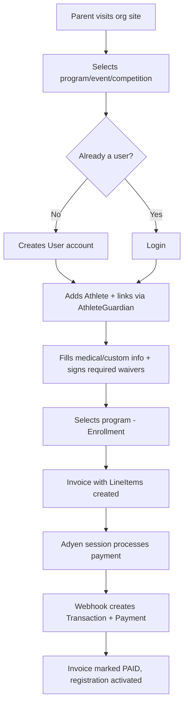
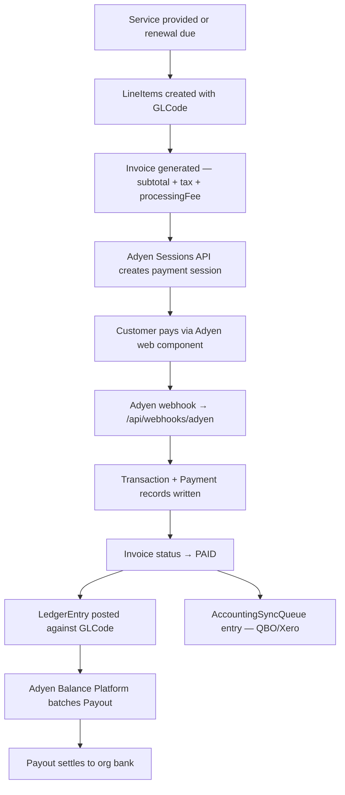
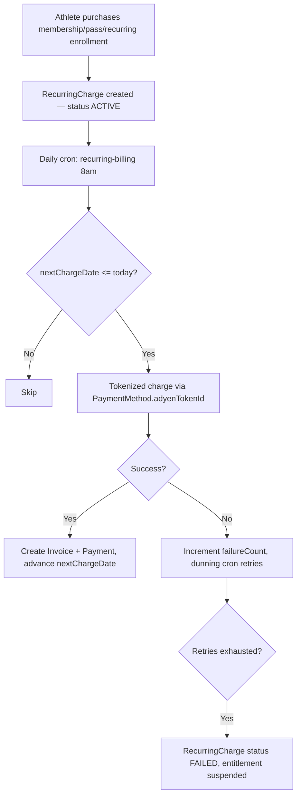
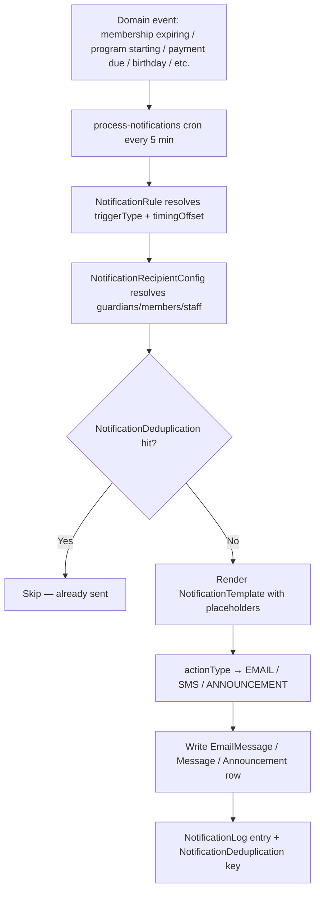

# Uplifter Data Structure — Overview

A high-level map of the platform's core entities and cross-domain flows. For attribute-level detail on every model, see **[ERD.md](./ERD.md)**. For architecture context, see **[ARCHITECTURE.md](../ARCHITECTURE.md)**.

## Top-level Entity Map

Core relationships across all major domains. Details per domain are in [ERD.md](./ERD.md).

```mermaid
erDiagram
    Organization ||--o{ OrganizationMember : "has staff/parents"
    Organization ||--o{ Program : "offers"
    Organization ||--o{ Event : "hosts"
    Organization ||--o{ Competition : "hosts"
    Organization ||--o{ Season : "organizes into seasons"
    Organization ||--o{ Facility : "operates"
    Organization ||--o{ MembershipGroup : "sells"
    Organization ||--o{ Pass : "sells"
    Organization ||--o{ Product : "sells"
    Organization ||--o{ Invoice : "bills"
    Organization ||--o{ Waiver : "publishes"
    Organization ||--o| WebsiteConfig : "marketing site"
    Organization ||--o| OrganizationSubscription : "platform plan"
    Organization ||--o| AdyenPlatformAccount : "merchant onboarding"
    Organization ||--o{ OrganizationAthlete : "rosters"

    User ||--o{ OrganizationMember : "joins orgs"
    User ||--o{ AthleteGuardian : "guardian of"
    User ||--o| Athlete : "self-athlete (adult)"
    User ||--o{ Invoice : "billed (guardian)"
    User ||--o{ PaymentMethod : "stored cards"

    Athlete ||--o{ AthleteGuardian : "has guardians"
    Athlete ||--o{ OrganizationAthlete : "visible to orgs"
    Athlete ||--o| AthleteMedicalInfo : "medical record (cross-org)"
    Athlete ||--o{ Enrollment : "enrolled"
    Athlete ||--o{ AthleteMembership : "memberships"
    Athlete ||--o{ AthletePass : "passes"
    Athlete ||--o{ CompetitionEntry : "competes"
    Athlete ||--o{ Evaluation : "evaluated"
    Athlete ||--o{ WaiverAcceptance : "signs waivers"

    Program ||--o{ ProgramInstance : "rrule sessions"
    Program ||--o{ Enrollment : "enrolled athletes"
    ProgramInstance ||--o{ InstanceRegistration : "per-session signup"
    ProgramInstance ||--o{ InstanceAttendance : "attendance"

    MembershipGroup ||--o{ MembershipInstance : "periods (e.g. FY25)"
    MembershipInstance ||--o{ AthleteMembership : "holders"

    Invoice ||--o{ LineItem : "line items"
    Invoice ||--o{ Payment : "payments"
    Payment ||--o| Transaction : "Adyen PSP"
    Organization ||--o{ Payout : "Adyen settlement"
    Payout ||--o{ Transaction : "batched"

    Facility ||--o{ Space : "rooms/zones"
    Facility ||--o{ Equipment : "houses"
```

**Tenancy note.** Every table except a small shared set carries `organizationId` and is automatically scoped by [`getScopedDb()`](../src/lib/db.ts). The intentional exceptions — shared across tenants — are `User`, `Athlete`, `AthleteMedicalInfo`, `AthleteGuardian`, and the global `Sport`/`SportEvent`/`SportAgeCategory`/`ReservedDomain` catalogs. See [ARCHITECTURE.md §Tenant Isolation](../ARCHITECTURE.md#tenant-isolation-getscopeddb).

## Domain Index

Each domain has a dedicated section in [ERD.md](./ERD.md) with field-level definitions:

| Domain                         | ERD section                                             | Key entities                                                                                          |
| ------------------------------ | ------------------------------------------------------- | ----------------------------------------------------------------------------------------------------- |
| Orgs, Users, Auth              | [§1](./ERD.md#1-foundation)                             | `Organization`, `User`, `OrganizationMember`, `Session`, `Account`, `OrganizationInvitation`          |
| Athletes & Guardians           | [§2](./ERD.md#2-athletes--guardians)                    | `Athlete`, `AthleteGuardian`, `OrganizationAthlete`, `GuardianClaimRequest`                           |
| Medical & Custom Info          | [§3](./ERD.md#3-medical--custom-information)            | `AthleteMedicalInfo`, `MedicalFormConfig`, `CustomMedicalQuestion`, `CustomInfoQuestion`              |
| Programs & Scheduling          | [§4](./ERD.md#4-programs-instances-seasons-enrollments) | `Program`, `ProgramInstance`, `Season`, `Enrollment`, `InstanceRegistration`                          |
| Events & Attendance            | [§5](./ERD.md#5-events--attendance)                     | `Event`, `Attendance`                                                                                 |
| Memberships & Passes           | [§6](./ERD.md#6-memberships--passes)                    | `MembershipGroup`, `MembershipInstance`, `AthleteMembership`, `Pass`, `AthletePass`                   |
| Evaluations & Skills           | [§7](./ERD.md#7-evaluations-skills-achievements)        | `Skill`, `Level`, `EvaluationTemplate`, `Evaluation`, `Achievement`, `LessonPlan`                     |
| Competitions & Sports          | [§8](./ERD.md#8-competitions--sports)                   | `Sport`, `SportEvent`, `Competition`, `CompetitionCategory`, `CompetitionEntry`, `CompetitionResult`  |
| Financial                      | [§9](./ERD.md#9-financial-invoices-payments-ledger)     | `Invoice`, `LineItem`, `Payment`, `Transaction`, `Payout`, `RecurringCharge`, `GLCode`, `LedgerEntry` |
| Waivers                        | [§10](./ERD.md#10-waivers--signatures)                  | `Waiver`, `WaiverPage`, `WaiverSignature`, `WaiverAcceptance`                                         |
| Facilities                     | [§11](./ERD.md#11-facilities-spaces-equipment)          | `Facility`, `Space`, `Equipment`, `FacilityAssignment`                                                |
| Staff & Scheduling             | [§12](./ERD.md#12-staff--scheduling)                    | `Shift`, `ScheduleTemplate`, `MemberAvailability`, `EventStaff`, `ProgramStaff`, `Certification`      |
| Communications                 | [§13](./ERD.md#13-communications)                       | `Message`, `EmailMessage`, `SmsCampaign`, `EmailCampaign`, `Conversation`, `Announcement`             |
| Notifications                  | [§14](./ERD.md#14-notifications)                        | `NotificationRule`, `NotificationTemplate`, `NotificationLog`                                         |
| Products & POS                 | [§15](./ERD.md#15-products--pos)                        | `Product`, `ProductVariant`, `StockMovement`, `Order`                                                 |
| Registration Queue             | [§16](./ERD.md#16-registration-queue)                   | `RegistrationQueueConfig`, `QueueEntry`, `QueueReservation`                                           |
| Platform Subscription          | [§17](./ERD.md#17-platform-subscription)                | `SubscriptionPlan`, `OrganizationSubscription`, `SubscriptionInvoice`, `AdyenPlatformAccount`         |
| Accounting Integrations        | [§18](./ERD.md#18-accounting-integrations)              | `AccountingConnection`, `AccountingSyncQueue`, `AccountingSyncLog`                                    |
| Feedback                       | [§19](./ERD.md#19-feedback--feature-requests)           | `FeatureRequest`, `FeatureVote`, `FeatureComment`                                                     |
| Misc (Media, Categories, etc.) | [§20](./ERD.md#20-misc--cross-cutting)                  | `Media`, `RegistrationFile`, `Category`, `OrganizationHoliday`, `WebsiteConfig`                       |

## Key Design Patterns

**Cross-org athletes.** `Athlete` has no `organizationId`. Athletes are surfaced to an org via `OrganizationAthlete` (which holds the org-specific `level`, `status`, and `customId`). `AthleteMedicalInfo` is shared across orgs for athlete safety — see [ARCHITECTURE.md §Shared Medical Data](../ARCHITECTURE.md#shared-medical-data).

**Guardians, not Families.** The platform does not have a `Family` entity. A parent is a `User` with `role = PARENT`. Parent ↔ Athlete linkage lives in `AthleteGuardian`; multi-family scenarios use `GuardianClaimRequest` for the approval workflow. Billing flows directly to the guardian `User` (invoices/payments/recurring charges all FK to `User`, not a family).

**Users span orgs.** A single `User` may hold memberships in many organizations via `OrganizationMember`, each with its own role and per-org profile fields (employment type, title, hourly rate, emergency contact). There is no separate `StaffProfile` — those fields are inlined on `OrganizationMember`.

**Polymorphic billing.** `LineItem` points to any of `Program`, `Event`, `Athlete`, `MembershipInstance`, `Pass`, `Competition`, `CompetitionCategory`, `Product`, or `ProductVariant` via nullable FKs. The line-item description is the canonical label; the FK set tells you the entitlement being purchased.

**Program recurrence.** A `Program` carries an RFC 5545 `rrule`. Concrete sessions are materialized as `ProgramInstance` rows. Registration happens either at program level (`Enrollment`, default) or per-session (`InstanceRegistration`, when `registrationType = PER_INSTANCE`).

**Soft-delete via status.** No hard deletes across the schema — `status` enums carry values like `ARCHIVED`, `CANCELLED`, `INACTIVE`. Inspect model-specific status enums in [ERD.md](./ERD.md).

**Campaign → Message fanout.** `SmsCampaign` and `EmailCampaign` target audiences via `targetType` + filter fields, and expand into individual `Message` / `EmailMessage` rows linked via `campaignId`.

---

## Cross-Domain Data Flows

### Registration

Queue flow (`RegistrationQueueConfig` + `QueueEntry`) sits between step R2 and R8 when enabled.

### Payment / Settlement

### Recurring Billing

### Notification Rules

---

## Enum Reference

Frequently-looked-up enum values. The [Prisma schema](../prisma/schema.prisma) is the source of truth.

### Users & Access

| Enum                           | Values                                                                      |
| ------------------------------ | --------------------------------------------------------------------------- |
| `Role`                         | `ADMIN`, `COACH`, `VOLUNTEER`, `ACCOUNTANT`, `CUSTOM`, `PARENT`             |
| `UserStatus`                   | `ACTIVE`, `INVITED`, `INACTIVE`                                             |
| `MemberStatus`                 | `ACTIVE`, `INVITED`, `INACTIVE`                                             |
| `EmploymentType`               | `FULL_TIME`, `PART_TIME`, `CONTRACTOR`, `VOLUNTEER`                         |
| `OrganizationInvitationStatus` | `PENDING`, `ACCEPTED`, `EXPIRED`, `CANCELLED`                               |
| `VerificationCodeType`         | `MFA_CHALLENGE`, `EMAIL_LOGIN`, `SIGNUP_VERIFICATION`, `PHONE_VERIFICATION` |

### Athletes

| Enum                | Values                                         |
| ------------------- | ---------------------------------------------- |
| `AthleteStatus`     | `ACTIVE`, `INACTIVE`, `TRIAL`, `GRADUATED`     |
| `GenderDeclaration` | `MALE`, `FEMALE`, `OTHER`, `PREFER_NOT_TO_SAY` |
| `ClaimStatus`       | `PENDING`, `APPROVED`, `DENIED`                |

### Programs / Events / Attendance

| Enum                 | Values                                                     |
| -------------------- | ---------------------------------------------------------- |
| `ProgramStatus`      | `ACTIVE`, `INACTIVE`, `ARCHIVED`                           |
| `RegistrationType`   | `ALL_INSTANCES`, `PER_INSTANCE`                            |
| `PricingModel`       | `FLAT_RATE`, `PER_SESSION`                                 |
| `BillingInterval`    | `ONE_TIME`, `MONTHLY`, `YEARLY`, `SESSION`                 |
| `InstanceStatus`     | `SCHEDULED`, `CANCELLED`, `COMPLETED`                      |
| `RegistrationStatus` | `REGISTERED`, `WAITLISTED`, `CANCELLED`                    |
| `EnrollmentStatus`   | `ACTIVE`, `WAITLISTED`, `PAUSED`, `CANCELLED`, `COMPLETED` |
| `EventType`          | `CLASS`, `CLINIC`, `PARTY`, `TRYOUT`, `MEETING`, `OTHER`   |
| `AttendanceStatus`   | `REGISTERED`, `PRESENT`, `ABSENT`, `LATE`, `EXCUSED`       |
| `SeasonStatus`       | `DRAFT`, `ACTIVE`, `CLOSED`, `EXPIRED`, `CANCELLED`        |
| `SpaceCapacityMode`  | `MINIMUM`, `SUM`                                           |

### Memberships & Passes

| Enum                       | Values                                                |
| -------------------------- | ----------------------------------------------------- |
| `MembershipStatus`         | `ACTIVE`, `EXPIRED`, `CANCELLED`, `ARCHIVED`          |
| `MembershipInstanceStatus` | `DRAFT`, `ACTIVE`, `EXPIRED`, `CANCELLED`, `ARCHIVED` |
| `BulkDiscountType`         | `FAMILY_SIBLING`, `MULTI_SESSION`                     |
| `PassStatus`               | `ACTIVE`, `EXPIRED`, `CANCELLED`, `ARCHIVED`          |
| `PassLimitPeriod`          | `WEEKLY`, `MONTHLY`                                   |

### Financial

| Enum                | Values                                                                          |
| ------------------- | ------------------------------------------------------------------------------- |
| `InvoiceStatus`     | `DRAFT`, `SENT`, `PAID`, `OVERDUE`, `CANCELLED`, `PARTIAL`                      |
| `PaymentType`       | `CARD`, `BANK`, `CASH`, `CHECK`                                                 |
| `PaymentStatus`     | `PENDING`, `COMPLETED`, `FAILED`, `REFUNDED`                                    |
| `PaymentMethodType` | `CARD`, `BANK`                                                                  |
| `TransactionType`   | `PAYMENT`, `REFUND`, `CHARGEBACK`, `CAPTURE`, `CANCEL`                          |
| `TransactionStatus` | `AUTHORISED`, `CAPTURED`, `SETTLED`, `REFUSED`, `CANCELLED`, `ERROR`, `PENDING` |
| `PayoutStatus`      | `PENDING`, `SCHEDULED`, `PAID`, `FAILED`                                        |
| `FeePayer`          | `CUSTOMER`, `ORGANIZATION`                                                      |
| `RecurringStatus`   | `ACTIVE`, `PAUSED`, `CANCELLED`, `FAILED`                                       |
| `DiscountType`      | `PERCENTAGE`, `FIXED_AMOUNT`                                                    |
| `DiscountStatus`    | `ACTIVE`, `EXPIRED`, `SCHEDULED`, `DRAFT`                                       |
| `UserScope`         | `ALL`, `NEW_USERS`, `MEMBERS`, `VIP`                                            |
| `ProductScope`      | `ALL`, `MERCHANDISE`, `EVENTS`, `MEMBERSHIP`                                    |
| `GLCodeType`        | `REVENUE`, `EXPENSE`, `LIABILITY`, `ASSET`, `EQUITY`                            |
| `GLCodeStatus`      | `ACTIVE`, `INACTIVE`                                                            |
| `GLCodeEntityType`  | `PROGRAM`, `EVENT`, `COMPETITION`, `MEMBERSHIP`, `PASS`, `PRODUCT`              |
| `LedgerEntryStatus` | `POSTED`, `PENDING`                                                             |

### Evaluations

| Enum                            | Values                                                                 |
| ------------------------------- | ---------------------------------------------------------------------- |
| `EvaluationStatus`              | `PENDING`, `IN_PROGRESS`, `PASS`, `RETRY`, `EXCELLENT`, `SATISFACTORY` |
| `SkillAttemptStatus`            | `NOT_ATTEMPTED`, `ATTEMPTED`, `SUCCEEDED`                              |
| `ScoringType`                   | `PASS_FAIL`, `POINT_SCALE`                                             |
| `CompletionType`                | `PERCENTAGE`, `COUNT`, `ALL`                                           |
| `LessonPlanStatus`              | `ACTIVE`, `DRAFT`, `ARCHIVED`                                          |
| `CertificationEvaluationMethod` | `PASS_FAIL`, `POINT_SCALE`                                             |

### Competitions

| Enum                     | Values                                                                                                    |
| ------------------------ | --------------------------------------------------------------------------------------------------------- |
| `CompetitionStatus`      | `DRAFT`, `PUBLISHED`, `REGISTRATION_OPEN`, `REGISTRATION_CLOSED`, `IN_PROGRESS`, `COMPLETED`, `CANCELLED` |
| `CompetitionPricingMode` | `FREE`, `PER_COMPETITION`, `PER_EVENT`, `TIERED`, `PER_CATEGORY`                                          |
| `EntryStatus`            | `PENDING_SEED`, `PENDING_REVIEW`, `APPROVED`, `REJECTED`, `WITHDRAWN`, `SCRATCHED`                        |
| `ResultType`             | `TIME`, `DISTANCE`, `HEIGHT`, `SCORE`, `PLACEMENT`                                                        |
| `SortDirection`          | `ASC`, `DESC`                                                                                             |
| `SubmissionMode`         | `NONE`, `VERIFIED_RESULT`, `MANUAL_ENTRY`                                                                 |
| `SubmissionStatus`       | `PENDING`, `APPROVED`, `REJECTED`                                                                         |
| `CategoryTemplateType`   | `COMBINATION`, `INDIVIDUAL`                                                                               |
| `CategoryAxis`           | `ROW`, `COLUMN`                                                                                           |

### Medical / Custom Info

| Enum                     | Values                                                                                                                                               |
| ------------------------ | ---------------------------------------------------------------------------------------------------------------------------------------------------- |
| `MedicalQuestionType`    | `TEXT`, `YES_NO`, `MULTIPLE_CHOICE`, `CHECKBOX`                                                                                                      |
| `CustomInfoQuestionType` | `VALUE`, `BOOLEAN`, `SIGNATURE`, `SHORT_TEXT`, `LONG_TEXT`, `IMAGE`                                                                                  |
| `CustomInfoScopeType`    | `ALL_PROGRAMS`, `ALL_EVENTS`, `ALL_COMPETITIONS`, `ALL_MEMBERSHIPS`, `ALL_PASSES`, `PROGRAM`, `EVENT`, `COMPETITION`, `MEMBERSHIP`, `PASS`, `SEASON` |

### Facilities

| Enum                 | Values                                        |
| -------------------- | --------------------------------------------- |
| `FacilityStatus`     | `ACTIVE`, `INACTIVE`, `MAINTENANCE`           |
| `SpaceStatus`        | `OPEN`, `CLOSED`, `MAINTENANCE`               |
| `EquipmentCondition` | `EXCELLENT`, `GOOD`, `FAIR`, `POOR`, `UNSAFE` |
| `EquipmentStatus`    | `ACTIVE`, `RETIRED`, `MAINTENANCE`            |

### Staff & Scheduling

| Enum               | Values                                                                       |
| ------------------ | ---------------------------------------------------------------------------- |
| `ShiftStatus`      | `SCHEDULED`, `CONFIRMED`, `IN_PROGRESS`, `COMPLETED`, `CANCELLED`, `NO_SHOW` |
| `EventStaffRole`   | `LEAD`, `ASSISTANT`, `VOLUNTEER`, `OBSERVER`                                 |
| `ProgramStaffRole` | `LEAD_COACH`, `ASSISTANT_COACH`, `SUBSTITUTE`, `VOLUNTEER`                   |

### Communications

| Enum                                        | Values                                                                                                                                                              |
| ------------------------------------------- | ------------------------------------------------------------------------------------------------------------------------------------------------------------------- |
| `MessageChannel`                            | `WEB`, `SMS`, `EMAIL`                                                                                                                                               |
| `MessageStatus`                             | `QUEUED`, `SENDING`, `SENT`, `DELIVERED`, `UNDELIVERED`, `FAILED`                                                                                                   |
| `MessageDirection`                          | `OUTBOUND`, `INBOUND`                                                                                                                                               |
| `MessageClassification`                     | `GENERAL`, `REMINDER`, `ALERT`, `BILLING`, `EVENT`, `NEWS`                                                                                                          |
| `ConversationChannel`                       | `WEB_ONLY`, `WEB_SMS`, `WEB_EMAIL`                                                                                                                                  |
| `ConversationStatus`                        | `OPEN`, `CLOSED`, `ARCHIVED`                                                                                                                                        |
| `SmsTargetType` / `EmailTargetType`         | `ALL_USERS`, `ALL_MEMBERS`, `ALL_PROGRAM_REGISTRANTS`, `PROGRAM_ANY_INSTANCE`, `PROGRAM_SPECIFIC_INSTANCE`, `MEMBERSHIP_HOLDERS`, `SPECIFIC_USERS`, `ALL_GUARDIANS` |
| `SmsCampaignStatus` / `EmailCampaignStatus` | `DRAFT`, `SCHEDULED`, `SENDING`, `COMPLETED`, `FAILED`, `CANCELLED`                                                                                                 |
| `EmailStatus`                               | `QUEUED`, `SENDING`, `SENT`, `DELIVERED`, `OPENED`, `CLICKED`, `BOUNCED`, `COMPLAINED`, `FAILED`                                                                    |
| `EmailClassification`                       | `GENERAL`, `PROGRAM_UPDATE`, `EVENT_UPDATE`, `MEMBERSHIP`, `BILLING`, `NEWSLETTER`                                                                                  |
| `AnnouncementScope`                         | `ALL`, `PROGRAM`, `EVENT`, `GUARDIAN`                                                                                                                               |
| `AnnouncementStatus`                        | `DRAFT`, `PUBLISHED`, `ARCHIVED`                                                                                                                                    |
| `AnnouncementPriority`                      | `LOW`, `NORMAL`, `HIGH`, `URGENT`                                                                                                                                   |

### Notifications

| Enum                          | Values                                                                                                                                                                                                                                                                                                                                                                                                                                                                                    |
| ----------------------------- | ----------------------------------------------------------------------------------------------------------------------------------------------------------------------------------------------------------------------------------------------------------------------------------------------------------------------------------------------------------------------------------------------------------------------------------------------------------------------------------------- |
| `NotificationTriggerType`     | `MEMBERSHIP_EXPIRY`, `MEMBERSHIP_EXPIRED`, `PAYMENT_DUE`, `PAYMENT_OVERDUE`, `PAYMENT_RECEIVED`, `PROGRAM_REMINDER`, `PROGRAM_ENROLLMENT`, `PROGRAM_CANCELLATION`, `EVENT_REMINDER`, `EVENT_REGISTRATION_OPEN`, `EVENT_REGISTRATION_CLOSE`, `ATTENDANCE_MISSED`, `SKILL_ACHIEVED`, `EVALUATION_DUE`, `EVALUATION_COMPLETED`, `BIRTHDAY`, `WAITLIST_OPENING`, `RECURRING_CHARGE_UPCOMING`, `RECURRING_CHARGE_SUCCEEDED`, `RECURRING_CHARGE_FAILED`, `RECURRING_CHARGE_SUSPENDED`, `CUSTOM` |
| `NotificationActionType`      | `ANNOUNCEMENT`, `EMAIL`, `SMS`                                                                                                                                                                                                                                                                                                                                                                                                                                                            |
| `NotificationRecipientType`   | `GUARDIANS`, `MEMBERSHIP_HOLDERS`, `INTERNAL_USERS`, `CUSTOM`                                                                                                                                                                                                                                                                                                                                                                                                                             |
| `NotificationTimingDirection` | `BEFORE`, `AFTER`, `AT`                                                                                                                                                                                                                                                                                                                                                                                                                                                                   |
| `NotificationTimingUnit`      | `MINUTES`, `HOURS`, `DAYS`, `WEEKS`, `MONTHS`                                                                                                                                                                                                                                                                                                                                                                                                                                             |
| `NotificationLogStatus`       | `PENDING`, `SENT`, `DELIVERED`, `FAILED`, `SKIPPED`                                                                                                                                                                                                                                                                                                                                                                                                                                       |

### Products / POS / Queue / Misc

| Enum                     | Values                                                     |
| ------------------------ | ---------------------------------------------------------- |
| `StockMovementType`      | `SALE`, `RESTOCK`, `ADJUSTMENT`, `RETURN`                  |
| `OrderSource`            | `POS`, `ONLINE`                                            |
| `OrderFulfillmentStatus` | `PENDING`, `FULFILLED`, `CANCELLED`                        |
| `QueueActivationType`    | `ALWAYS`, `THRESHOLD`, `SCHEDULED`                         |
| `QueueEntryStatus`       | `WAITING`, `ADMITTED`, `COMPLETED`, `EXPIRED`, `ABANDONED` |
| `ReservationStatus`      | `ACTIVE`, `COMPLETED`, `EXPIRED`                           |
| `MediaType`              | `IMAGE`, `VIDEO`                                           |
| `WaiverStatus`           | `DRAFT`, `ACTIVE`, `ARCHIVED`                              |
| `HolidayType`            | `NATIONAL`, `CUSTOM`                                       |
| `FeatureStatus`          | `SUBMITTED`, `PLANNED`, `IN_PROGRESS`, `DONE`, `CLOSED`    |
| `ReservedDomainType`     | `EXACT`, `PREFIX`                                          |

### Platform Subscription / Adyen / Accounting

| Enum                        | Values                                                                                    |
| --------------------------- | ----------------------------------------------------------------------------------------- |
| `SubscriptionStatus`        | `ACTIVE`, `TRIALING`, `PAST_DUE`, `CANCELLED`, `PAUSED`                                   |
| `BillingCycle`              | `MONTHLY`, `YEARLY`                                                                       |
| `SubscriptionInvoiceStatus` | `PENDING`, `PROCESSING`, `PAID`, `FAILED`, `VOID`                                         |
| `AdyenOnboardingStatus`     | `PENDING_HOSTED`, `IN_PROGRESS`, `AWAITING_DATA`, `IN_REVIEW`, `VERIFIED`, `REJECTED`     |
| `AccountingProvider`        | `QBO`, `XERO`                                                                             |
| `AccountingEntityType`      | `ACCOUNT`, `CUSTOMER`, `ITEM`, `INVOICE`, `PAYMENT`, `REFUND`, `JOURNAL_ENTRY`, `DEPOSIT` |
| `AccountingSyncAction`      | `CREATE`, `UPDATE`                                                                        |
| `AccountingSyncStatus`      | `PENDING`, `PROCESSING`, `COMPLETED`, `FAILED`                                            |
| `AccountingMappingType`     | `GL_CODE`, `BANK_ACCOUNT`, `PROCESSING_FEES`, `REFUNDS`, `UNDEPOSITED_FUNDS`              |
