# Uplifter Data Structure

## Entity Relationship Overview

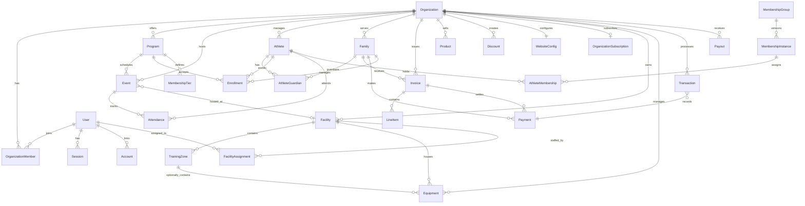

## Core Domain Models

### Multi-Tenancy Layer

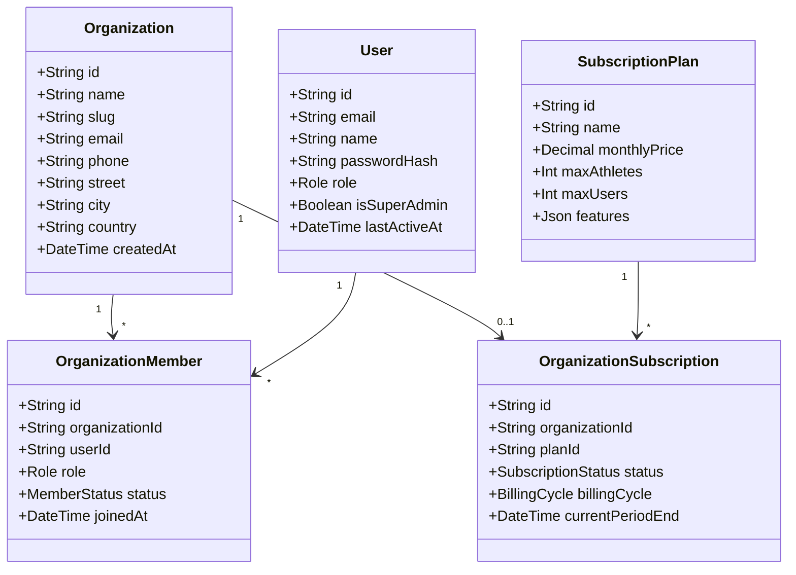

### Athletes & Families

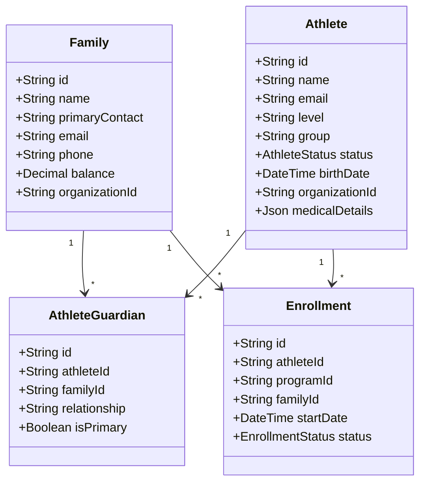

### Programs & Memberships

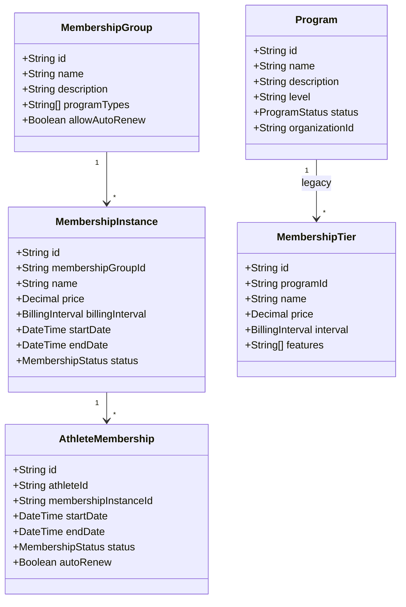

### Events & Attendance

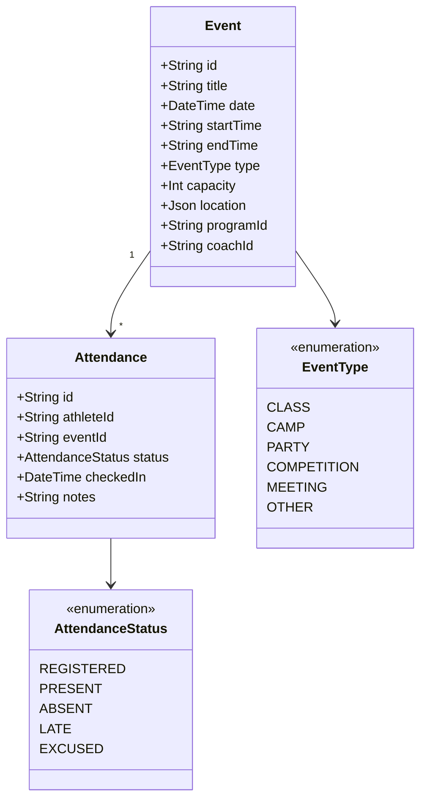

### Facilities & Equipment

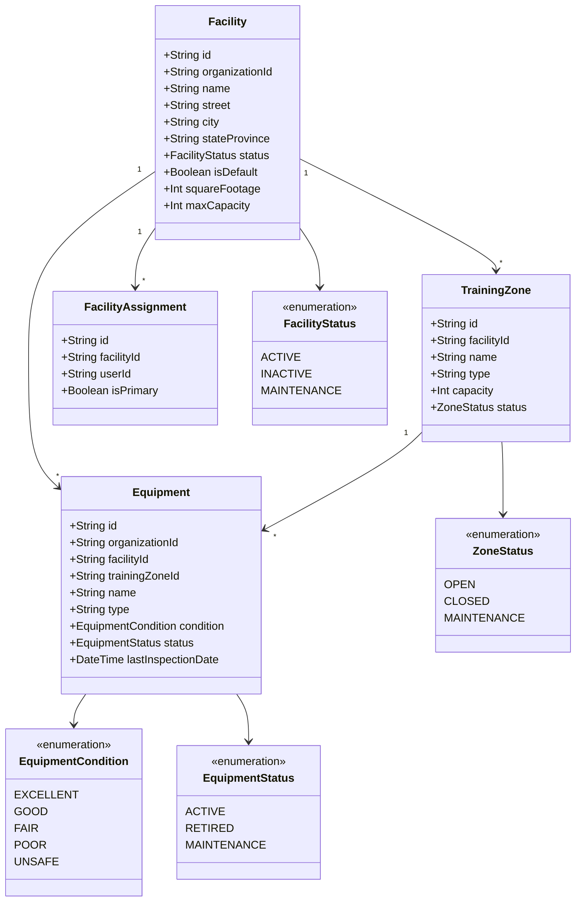

### Financial System

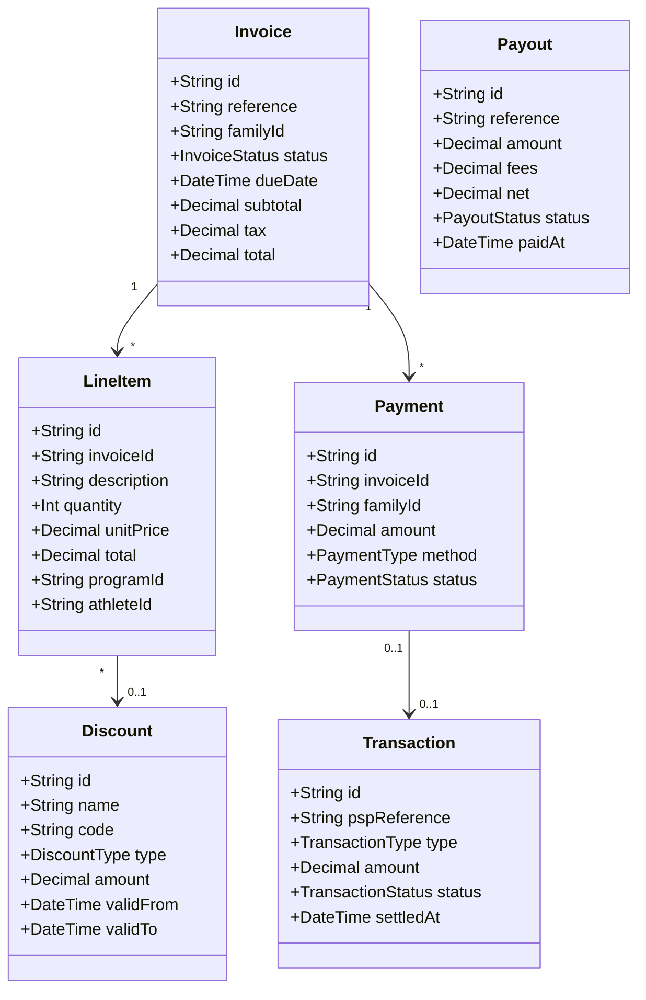

### Ledger & Accounting

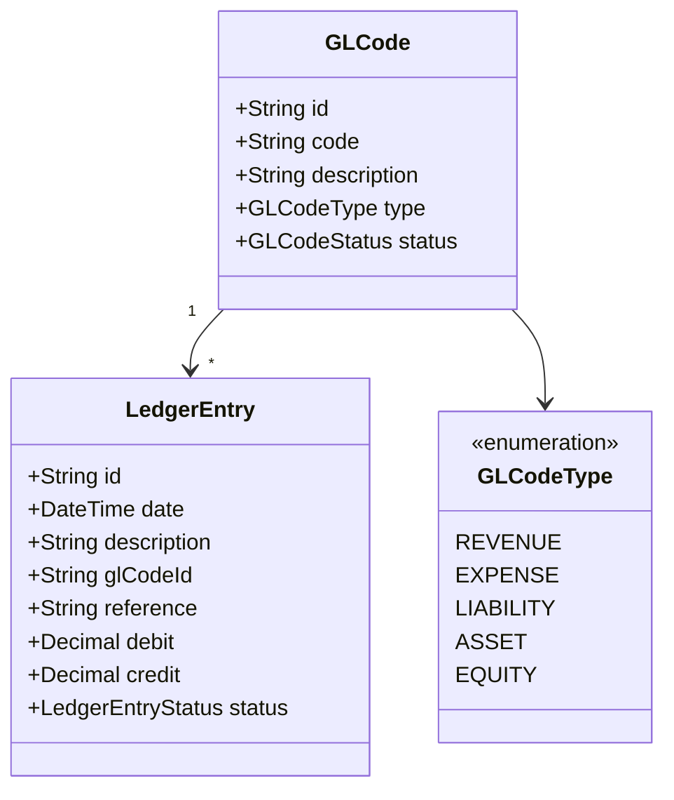

### Website & CMS

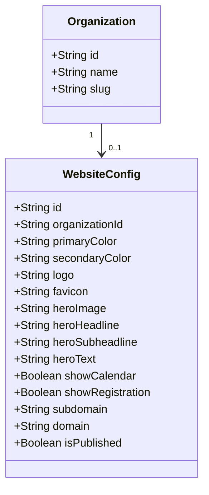

### POS & Products

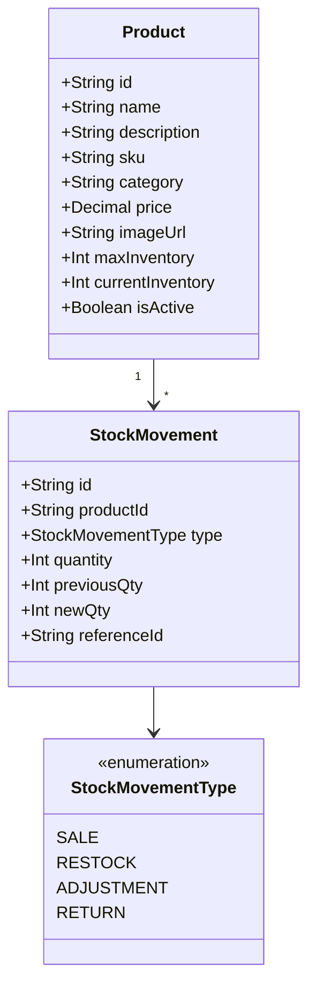

## Data Flow

```mermaid
flowchart TD
    subgraph Registration["Registration Flow"]
        R1[Parent visits site] --> R2[Selects program]
        R2 --> R3[Creates family account]
        R3 --> R4[Adds athlete]
        R4 --> R5[Enrolls in program]
        R5 --> R6[Invoice generated]
        R6 --> R7[Payment processed]
    end

    subgraph Attendance["Attendance Flow"]
        A1[Event scheduled] --> A2[Athletes enrolled]
        A2 --> A3[Coach takes attendance]
        A3 --> A4[Status recorded]
        A4 --> A5[Metrics calculated]
    end

    subgraph Financial["Financial Flow"]
        F1[Service provided] --> F2[Line item created]
        F2 --> F3[Invoice sent]
        F3 --> F4[Payment received]
        F4 --> F5[Transaction recorded]
        F5 --> F6[Ledger entry posted]
        F6 --> F7[Payout scheduled]
    end
```

## Enum Reference

| Enum | Values |
|------|--------|
| Role | ADMIN, COACH, VOLUNTEER, ACCOUNTANT, CUSTOM, PARENT, STAFF |
| AthleteStatus | ACTIVE, INACTIVE, TRIAL, GRADUATED |
| ProgramStatus | ACTIVE, INACTIVE, ARCHIVED |
| EventType | CLASS, CAMP, PARTY, COMPETITION, MEETING, OTHER |
| AttendanceStatus | REGISTERED, PRESENT, ABSENT, LATE, EXCUSED |
| InvoiceStatus | DRAFT, SENT, PAID, OVERDUE, CANCELLED, PARTIAL |
| PaymentStatus | PENDING, COMPLETED, FAILED, REFUNDED |
| TransactionStatus | AUTHORISED, CAPTURED, SETTLED, REFUSED, CANCELLED, ERROR, PENDING |
| MembershipStatus | ACTIVE, EXPIRED, CANCELLED, ARCHIVED |
| BillingInterval | MONTHLY, YEARLY, SESSION |
| SubscriptionStatus | ACTIVE, TRIALING, PAST_DUE, CANCELLED, PAUSED |
| FacilityStatus | ACTIVE, INACTIVE, MAINTENANCE |
| ZoneStatus | OPEN, CLOSED, MAINTENANCE |
| EquipmentCondition | EXCELLENT, GOOD, FAIR, POOR, UNSAFE |
| EquipmentStatus | ACTIVE, RETIRED, MAINTENANCE |
