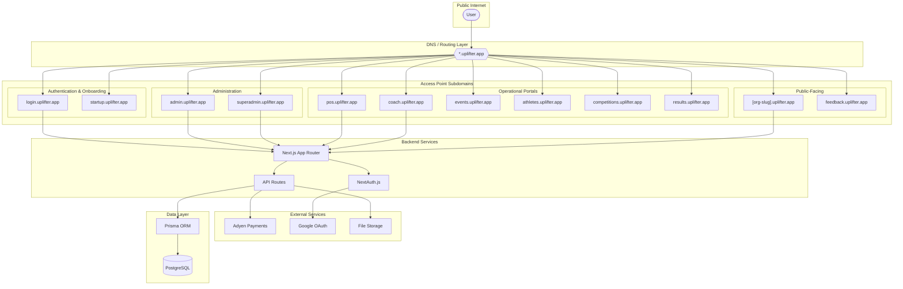
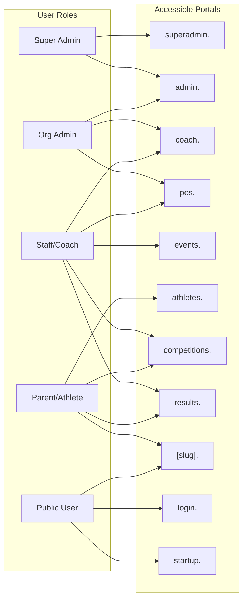
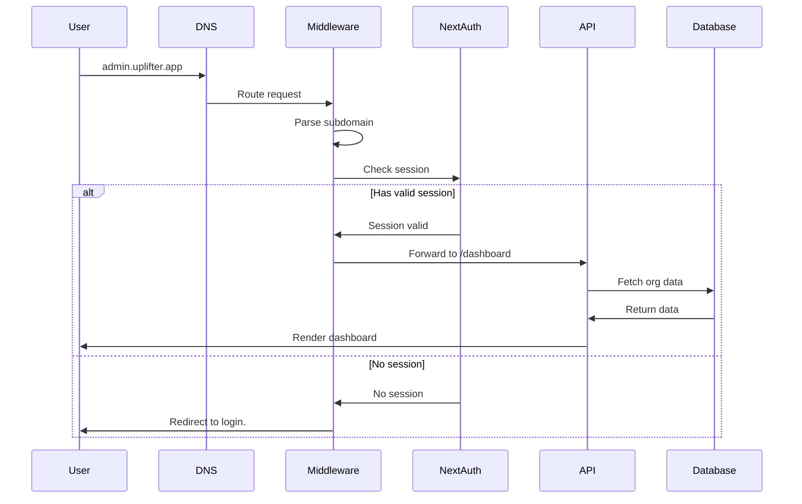
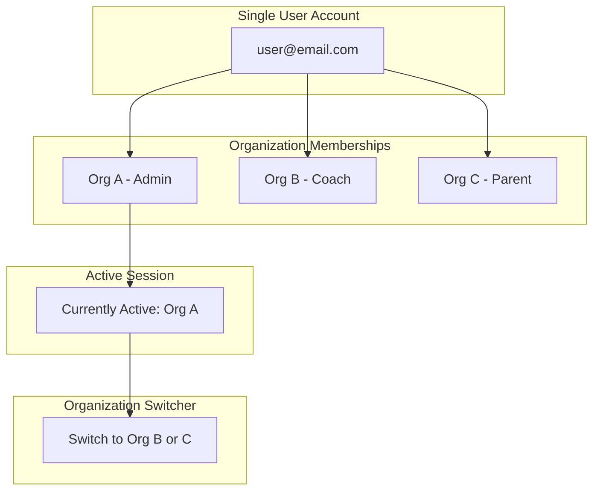

# Uplifter Platform Architecture

## Overview

Uplifter is a multi-tenant SaaS platform for sports/gymnastics organizations. It uses a subdomain-based access point system where different user roles access different portals.

## Platform Diagram

## Access Points by Role

## Portal Descriptions

| Subdomain       | Purpose                                                          | Primary Users            | Status  |
| --------------- | ---------------------------------------------------------------- | ------------------------ | ------- |
| `login.`        | Authentication, password reset & user signup                     | All users                | Live    |
| `startup.`      | New organization registration (supports partner referral params) | New customers            | Live    |
| `admin.`        | Organization management dashboard                                | Org Admins, Staff        | Live    |
| `superadmin.`   | Platform-wide administration                                     | Uplifter staff           | Live    |
| `pos.`          | Point of Sale terminal                                           | Staff at front desk      | Live    |
| `coach.`        | Coach mobile-friendly portal                                     | Coaches                  | Demo    |
| `events.`       | Event check-in portal                                            | Staff, Volunteers        | Hidden  |
| `competitions.` | Competition browsing and management                              | Staff, Parents, Athletes | Planned |
| `results.`      | Competition results and scores                                   | Staff, Parents, Athletes | Planned |
| `athletes.`     | Parent/Athlete self-service                                      | Parents, Athletes        | Live    |
| `[org-slug].`   | Public marketing site                                            | Public visitors          | Live    |
| `feedback.`     | Feature requests & roadmap                                       | All users                | Live    |

## Request Flow

## Tenant Site Routing

The middleware rewrites tenant subdomain requests internally: a visit to `gym-name.uplifter.app/checkout` becomes `/sites/gym-name/checkout` at the routing layer, but the browser URL stays as `/checkout`.

**Key rule:** Client-side navigation within tenant sites (Link hrefs, router.push) must use simple paths (`/checkout`, `/register`, `/account`). Never include `/sites/{slug}/` in client-visible URLs — the middleware handles that prefix automatically. API fetch calls (`/api/sites/{slug}/...`) are unaffected since API routes bypass the rewrite. See `WEBSITE_BUILDER_README.md` for detailed examples.

## Multi-Organization Support

Users can belong to multiple organizations with different roles. The session tracks their currently active organization, and they can switch between organizations via the organization switcher in the sidebar.

## Standard UI Components

The platform uses a consistent set of form components across all portals (admin, athletes, marketing sites, org signup). New forms **must** use these rather than raw `<Input>` fields.

### Phone Numbers

| What               | Where                                                                     |
| ------------------ | ------------------------------------------------------------------------- |
| Input component    | `PhoneInput` from `@/components/ui/phone-input`                           |
| Client validation  | `isValidPhoneNumber()` from `react-phone-number-input`                    |
| Server validation  | `isValidPhoneNumber()` from `react-phone-number-input` in Zod `.refine()` |
| Display formatting | `formatPhoneNumberIntl()` from `react-phone-number-input`                 |
| Default country    | `"US"` via `defaultCountry` prop                                          |
| Storage format     | E.164 (e.g. `+15551234567`)                                               |
| Error styling      | `className={errors.phone ? "[&>input]:border-destructive" : ""}`          |

The `PhoneInput` wraps `react-phone-number-input` with shadcn/ui styling and a country-flag selector. Values are stored in E.164 format. Every phone input must validate with `isValidPhoneNumber` on both client and server, and every phone display must use `formatPhoneNumberIntl(phone) || phone` for user-facing output. Never use `<Input type="tel">` for phone fields.

### Address Fields

| What                   | Where                                                                                                |
| ---------------------- | ---------------------------------------------------------------------------------------------------- |
| Country/region data    | `COUNTRIES`, `getRegionsForCountry()` from `@/lib/location-data`                                     |
| Postal code validation | `isValidPostalCode()` from `@/lib/location-data`                                                     |
| Country input          | `Select` dropdown with `COUNTRIES` list                                                              |
| State/Province input   | Searchable `Popover` + `Command` combobox using `getRegionsForCountry()`                             |
| Postal/ZIP code input  | Standard `Input` with contextual label (`"ZIP Code"` for US, `"Postal Code"` for CA) and placeholder |

Key behaviors:

- Changing country resets state/province selection
- When `getRegionsForCountry()` returns an empty array (unsupported country), state/province falls back to a plain text `Input`
- `isValidPostalCode()` enforces US ZIP (5 or 5+4 digit) and Canadian postal code (A1A 1A1) formats
- Display should resolve codes to names: use `COUNTRIES.find()` for country names and `getRegionsForCountry().find()` for state/province names

### Used In

- **Org signup** (`src/app/org-signup/page.tsx`) — organization address
- **Competition stepper** (`src/app/dashboard/competitions/components/competition-stepper.tsx`) — venue location
- **Athletes billing** (`src/app/athletes/billing/page.tsx`) — saved billing addresses & contacts
- **Marketing site checkout** (`src/app/sites/[slug]/checkout/page.tsx`) — checkout billing address
- **Marketing site account** (`src/app/sites/[slug]/account/page.tsx`) — saved contacts & addresses
