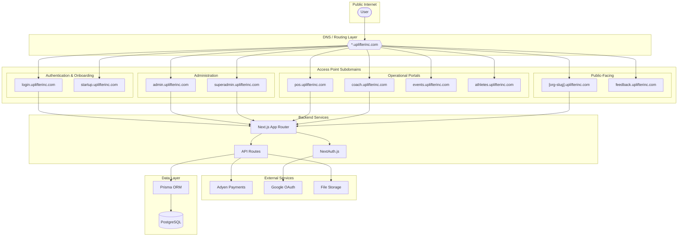
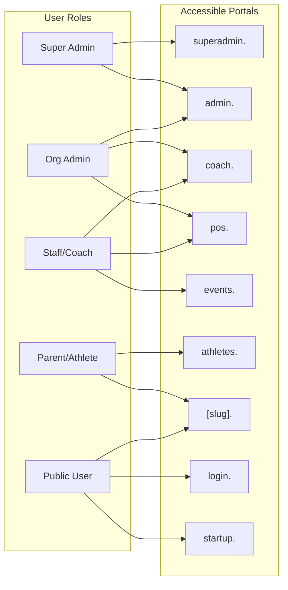
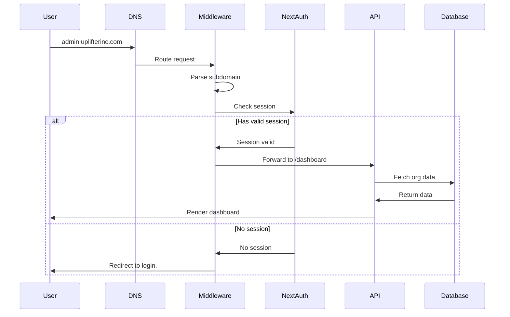
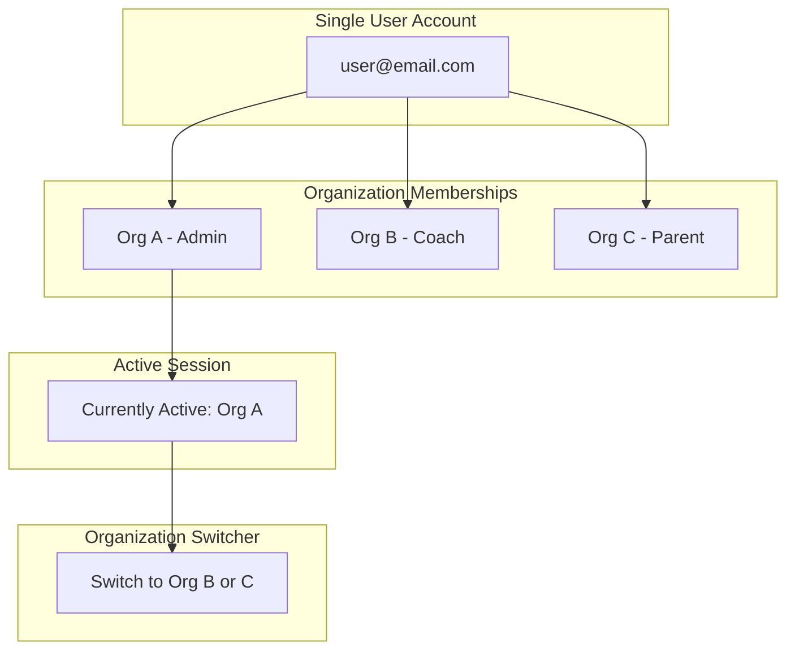

# Uplifter Platform Architecture

## Overview

Uplifter is a multi-tenant SaaS platform for sports/gymnastics organizations. It uses a subdomain-based access point system where different user roles access different portals.

## Platform Diagram

## Access Points by Role

## Portal Descriptions

| Subdomain | Purpose | Primary Users | Status |
|-----------|---------|---------------|--------|
| `login.` | Authentication, password reset & user signup | All users | Live |
| `startup.` | New organization registration (supports partner referral params) | New customers | Live |
| `admin.` | Organization management dashboard | Org Admins, Staff | Live |
| `superadmin.` | Platform-wide administration | Uplifter staff | Live |
| `pos.` | Point of Sale terminal | Staff at front desk | Live |
| `coach.` | Coach mobile-friendly portal | Coaches | Demo |
| `events.` | Event check-in portal | Staff, Volunteers | Hidden |
| `athletes.` | Parent/Athlete self-service | Parents, Athletes | Live |
| `[org-slug].` | Public marketing site | Public visitors | Live |
| `feedback.` | Feature requests & roadmap | All users | Live |

## Request Flow

## Multi-Organization Support

Users can belong to multiple organizations with different roles. The session tracks their currently active organization, and they can switch between organizations via the organization switcher in the sidebar.
