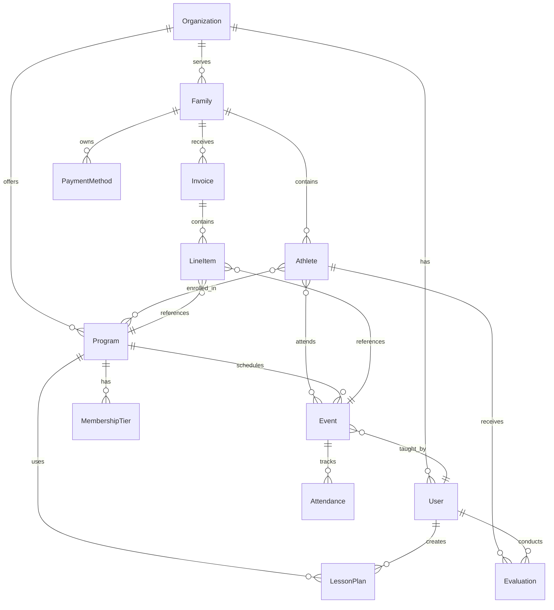
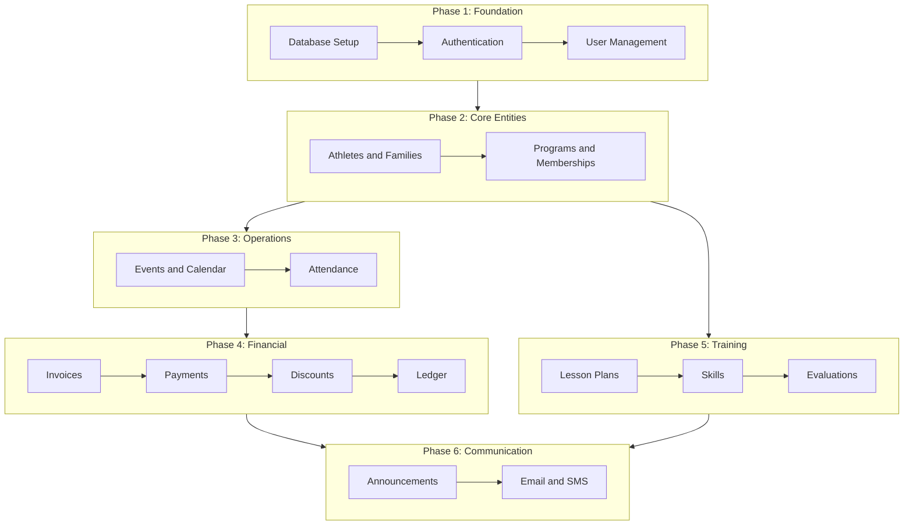

# Leapfrog Feature Implementation Plan

## Current State

The frontend is well-prepared with 50+ UI components and 30+ dashboard pages using mock data. No backend exists yet—no database, API routes, or authentication. All data lives in `src/mock-data/` files.

## Entity Relationship Model

Understanding how entities interconnect is critical for feature interplay:




---

## Phase 1: Foundation (Backend Infrastructure)

Establishes the infrastructure all other features depend on.

### 1.1 Database Setup

- Add Prisma ORM with PostgreSQL
- Create initial schema with `Organization`, `User` models
- Set up migrations workflow

**Key files to create:**

- `prisma/schema.prisma`
- `.env` with `DATABASE_URL`

### 1.2 Authentication System

- Implement NextAuth.js (Auth.js) with credentials + OAuth providers
- Organization-scoped authentication (users belong to orgs)
- Session management with JWT

**Key files:**

- `src/app/api/auth/[...nextauth]/route.ts`
- `src/lib/auth.ts`

### 1.3 User & Role Management

- Connect existing [users settings page](src/app/dashboard/settings/users/page.tsx) to real data
- Implement role-based access control (RBAC)
- Permission checking middleware

---

## Phase 2: Core Entities (Athletes, Families, Programs)

These are the foundational business objects that everything else references.

### 2.1 Athletes & Families

Replace mock data in `src/mock-data/athletes.ts` and `src/mock-data/families.ts` with real CRUD operations.

**Schema additions:**

```prisma
model Family {
  id            String    @id @default(cuid())
  name          String
  primaryContact String
  email         String
  phone         String
  address       String
  balance       Decimal   @default(0)
  athletes      Athlete[]
  invoices      Invoice[]
  paymentMethods PaymentMethod[]
}

model Athlete {
  id        String   @id @default(cuid())
  name      String
  email     String?
  level     String
  group     String
  status    String
  familyId  String
  family    Family   @relation(fields: [familyId], references: [id])
  enrollments Enrollment[]
  attendances Attendance[]
  evaluations Evaluation[]
}
```

**API routes:**

- `src/app/api/families/route.ts` - CRUD
- `src/app/api/athletes/route.ts` - CRUD

**Interplay**: Athletes link to Families, which link to Invoices and PaymentMethods.

### 2.2 Programs & Memberships

Connect [programs page](src/app/dashboard/training/programs/page.tsx) and [memberships page](src/app/dashboard/athletes/memberships/page.tsx).

**Schema additions:**

```prisma
model Program {
  id          String   @id @default(cuid())
  name        String
  description String?
  level       String
  status      String
  events      Event[]
  lessonPlans LessonPlan[]
  enrollments Enrollment[]
  lineItems   LineItem[]
}

model Enrollment {
  id         String   @id @default(cuid())
  athleteId  String
  programId  String
  startDate  DateTime
  endDate    DateTime?
  status     String
  athlete    Athlete  @relation(fields: [athleteId], references: [id])
  program    Program  @relation(fields: [programId], references: [id])
}
```

**Interplay**: Programs are what Athletes enroll in, Events are scheduled under, and Invoices bill for.

---

## Phase 3: Scheduling & Operations

### 3.1 Events & Calendar

Connect existing [calendar components](src/components/calendar/) and [events page](src/app/dashboard/events/page.tsx).

**Schema additions:**

```prisma
model Event {
  id           String   @id @default(cuid())
  title        String
  date         DateTime
  startTime    String
  endTime      String
  type         String   // Class, Camp, Party, Competition, Meeting, Other
  programId    String?
  coachId      String?
  location     Json?
  program      Program? @relation(fields: [programId], references: [id])
  coach        User?    @relation(fields: [coachId], references: [id])
  attendances  Attendance[]
  lineItems    LineItem[]
}
```

**Interplay**: Events belong to Programs, are taught by Users (coaches), and generate Attendance records.

### 3.2 Attendance Tracking

Connect [attendance page](src/app/dashboard/athletes/attendance/page.tsx).

**Schema additions:**

```prisma
model Attendance {
  id        String   @id @default(cuid())
  athleteId String
  eventId   String
  status    String   // Present, Absent, Late, Excused
  checkedIn DateTime?
  notes     String?
  athlete   Athlete  @relation(fields: [athleteId], references: [id])
  event     Event    @relation(fields: [eventId], references: [id])
}
```

**Interplay**: Links Athletes to Events with status tracking—critical for billing validation ("did they actually attend?").

---

## Phase 4: Financial System

This is where feature interplay becomes most important.

### 4.1 Invoice System

Connect [invoices page](src/app/dashboard/financials/invoices/page.tsx) and [create invoice sheet](src/components/invoices/create-invoice-sheet.tsx).

**Schema additions:**

```prisma
model Invoice {
  id          String     @id @default(cuid())
  reference   String     @unique
  familyId    String
  status      String     // Draft, Sent, Paid, Overdue, Cancelled
  dueDate     DateTime
  subtotal    Decimal
  tax         Decimal    @default(0)
  total       Decimal
  notes       String?
  createdAt   DateTime   @default(now())
  family      Family     @relation(fields: [familyId], references: [id])
  lineItems   LineItem[]
  payments    Payment[]
}

model LineItem {
  id          String   @id @default(cuid())
  invoiceId   String
  description String
  quantity    Int
  unitPrice   Decimal
  total       Decimal
  programId   String?  // What program is this for?
  eventId     String?  // What specific event?
  athleteId   String?  // Which athlete?
  invoice     Invoice  @relation(fields: [invoiceId], references: [id])
  program     Program? @relation(fields: [programId], references: [id])
  event       Event?   @relation(fields: [eventId], references: [id])
}
```

**Key Interplay**: Each LineItem can reference:

- The **Program** being billed (e.g., "JO Level 4 - Monthly")
- The specific **Event** (e.g., "Summer Camp Week 1")
- The **Athlete** the charge is for

This enables:

- "Show all invoices for Program X"
- "Show all charges for Athlete Y"
- "Revenue breakdown by program"

### 4.2 Payments & Transactions

Connect [transactions page](src/app/dashboard/financials/transactions/page.tsx).

**Schema additions:**

```prisma
model Payment {
  id            String   @id @default(cuid())
  invoiceId     String?
  familyId      String
  amount        Decimal
  method        String   // Card, Bank, Cash, Check
  status        String   // Pending, Completed, Failed, Refunded
  transactionId String?
  processedAt   DateTime?
  invoice       Invoice? @relation(fields: [invoiceId], references: [id])
}
```

### 4.3 Discounts Integration

Connect [discounts page](src/app/dashboard/financials/discounts/page.tsx) to invoicing.

**Interplay**: Discounts apply to Invoices with scoping by:

- User type (new users, members, VIP)
- Product scope (merchandise, events, membership)

### 4.4 General Ledger

Connect [ledger pages](src/app/dashboard/financials/ledgers/) for accounting integration.

---

## Phase 5: Training & Evaluations

### 5.1 Lesson Plans

Connect existing [lesson plan store](src/store/lesson-plan-store.ts) to database.

**Interplay**: Lesson plans belong to Programs and are created by Users (coaches).

### 5.2 Skills Database

Connect [skills page](src/app/dashboard/training/skills/page.tsx).

**Interplay**: Skills are used in Evaluations and referenced in Lesson Plans.

### 5.3 Evaluations

Connect evaluation system with Athletes and Skills.

**Schema:**

```prisma
model Evaluation {
  id           String   @id @default(cuid())
  athleteId    String
  coachId      String
  date         DateTime
  level        String
  overallScore Decimal
  status       String   // Pass, Retry, Excellent
  notes        String?
  athlete      Athlete  @relation(fields: [athleteId], references: [id])
  coach        User     @relation(fields: [coachId], references: [id])
  skillRatings EvaluationSkill[]
}
```

**Interplay**: Evaluations link Athletes to Coaches with Skill ratings—useful for:

- "Show all athletes who passed Level 4 evaluation"
- "Show evaluation history for Athlete X"

---

## Phase 6: Communication

### 6.1 Announcements

Connect [announcements page](src/app/dashboard/communication/announcements/page.tsx).

**Interplay**: Announcements can target:

- All families
- Specific programs
- Specific events

### 6.2 Email/SMS Integration

Connect [email](src/app/dashboard/communication/email/page.tsx) and [SMS](src/app/dashboard/communication/sms/page.tsx) pages.

**Interplay**: Triggered by:

- Invoice sent/overdue
- Event reminders
- Evaluation results

---

## Implementation Order & Dependencies




---

## Key Feature Interplay Examples


| Query                                          | Entities Involved                                     |
| ---------------------------------------------- | ----------------------------------------------------- |
| "All invoices for the Smith family"            | Invoice -> Family                                     |
| "Revenue from JO Level 4 program"              | LineItem -> Program -> Invoice                        |
| "Which athletes attended Summer Camp?"         | Attendance -> Event -> Athlete                        |
| "Unpaid invoices for athletes in Recreational" | Invoice -> Family -> Athlete -> Enrollment -> Program |
| "Coaches with most classes this month"         | Event -> User (coach)                                 |
| "Athletes who passed Level 3 evaluation"       | Evaluation -> Athlete                                 |


---

## Files to Create/Modify

**New Backend Files:**

- `prisma/schema.prisma` - Full database schema
- `src/app/api/` - API routes for each entity
- `src/lib/db.ts` - Prisma client singleton
- `src/lib/auth.ts` - Auth configuration

**Existing Files to Update:**

- `src/mock-data/*` - Replace with API calls
- `src/store/*` - Connect to API instead of local state
- Dashboard pages - Add loading states, error handling, real data fetching
